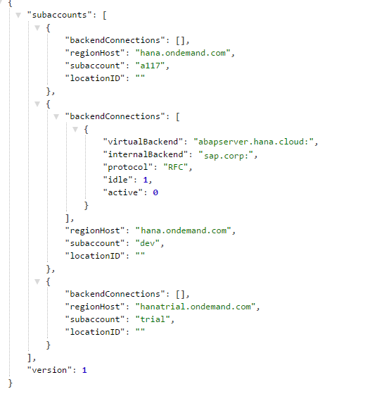
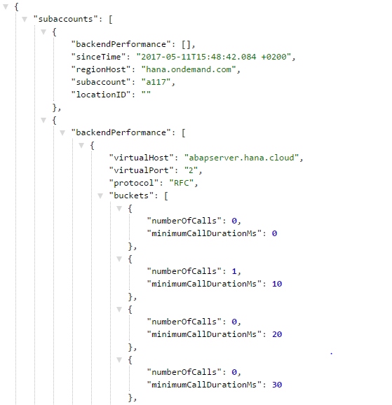
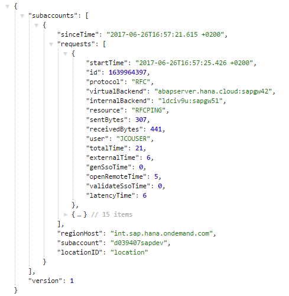
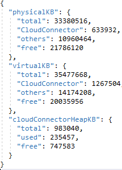
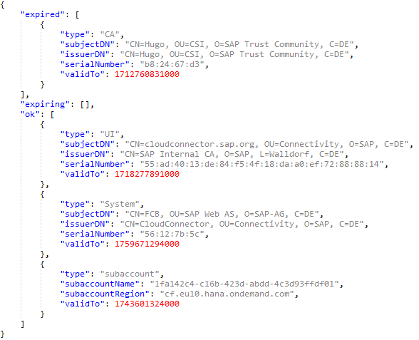
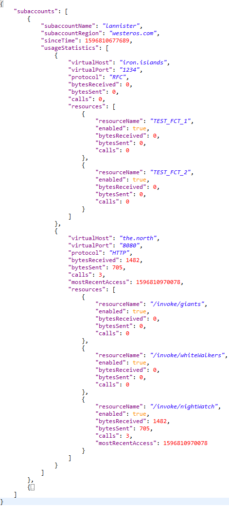

<!-- loiof6e7a7bc6af345d2a334c2427a31d294 -->

# Monitoring APIs

Use the Cloud Connector monitoring APIs to include monitoring information in your own monitoring tool.


<a name="loiof6e7a7bc6af345d2a334c2427a31d294__context"/>

## Context

You might want to integrate some monitoring information in the monitoring tool you use.

For this purpose, the Cloud Connector includes a collection of APIs that allow you to read various types of monitoring data.

> ### Note:  
> This API set is designed particularly for monitoring the Cloud Connector via the SAP Solution Manager, see [Configure Solution Management Integration](configure-solution-management-integration-3a058a2.md).

Before you start using these APIs, please also read the general introduction to [REST APIs](rest-apis-ede0776.md) provided by Cloud Connector.


<a name="loiof6e7a7bc6af345d2a334c2427a31d294__section_dcf_bfj_wz"/>

## Prerequisites

You must use*Basic Authentication* or *form field* authentication to read the monitoring data via API.

Users must be assigned to the roles `sccmonitoring` or `sccadmin`.

> ### Note:  
> The Health Check API does not require a specified user. Separate users are available through LDAP only.


<a name="loiof6e7a7bc6af345d2a334c2427a31d294__api"/>

## Available APIs

The following APIs are currently available.

-   [Health Check](monitoring-apis-f6e7a7b.md#loiof6e7a7bc6af345d2a334c2427a31d294__Health) \(available as of version 2.16.0\)
-   [Subaccount Data](monitoring-apis-f6e7a7b.md#loiof6e7a7bc6af345d2a334c2427a31d294__Subaccounts) \(as of 2.10.0\)
-   [Open Connections to On-Premise Backend Systems](monitoring-apis-f6e7a7b.md#loiof6e7a7bc6af345d2a334c2427a31d294__Connections) \(as of 2.10.0\)
-   [Open Connections to Cloud Services](monitoring-apis-f6e7a7b.md#loiof6e7a7bc6af345d2a334c2427a31d294__cloud) \(as of 2.15.0\)
-   [Performance Data](monitoring-apis-f6e7a7b.md#loiof6e7a7bc6af345d2a334c2427a31d294__Performance) \(as of 2.10.0\)
-   [Top Time Consumers](monitoring-apis-f6e7a7b.md#loiof6e7a7bc6af345d2a334c2427a31d294__Consumers) \(as of 2.11.0\)
-   [Memory Status](monitoring-apis-f6e7a7b.md#loiof6e7a7bc6af345d2a334c2427a31d294__memory) \(as of 2.13.0\)
-   [Certificate Status](monitoring-apis-f6e7a7b.md#loiof6e7a7bc6af345d2a334c2427a31d294__certificates) \(as of 2.13.0\)
-   [Certificate Selection List](monitoring-apis-f6e7a7b.md#loiof6e7a7bc6af345d2a334c2427a31d294__cert_selection) \(as of 2.13.0\)
-   [Usage Statistics](monitoring-apis-f6e7a7b.md#loiof6e7a7bc6af345d2a334c2427a31d294__usage) \(as of 2.13.0\)
-   [Master Role Check](monitoring-apis-f6e7a7b.md#loiof6e7a7bc6af345d2a334c2427a31d294__masterRole) \(as of 2.15.0\)

**Health Check \(available as of version 2.16.0\)**

Using the health check API, it is possible to recognize that the Cloud Connector is up and running. The purpose of this health check is only to verify that the Cloud Connector is not down. It does not check any internal state or tunnel connection states. Thus, it is a quick check that you can execute frequently:


<table>
<tr>
<td valign="top">

**URI** 

</td>
<td valign="top">

`/exposed?action=ping` 

</td>
</tr>
<tr>
<td valign="top">

**Method** 

</td>
<td valign="top">

`GET` 

</td>
</tr>
<tr>
<td valign="top">

**Request** 

</td>
<td valign="top">

 

</td>
</tr>
<tr>
<td valign="top">

**Response** 

</td>
<td valign="top">

 

</td>
</tr>
<tr>
<td valign="top">

**Errors** 

</td>
<td valign="top">

 

</td>
</tr>
<tr>
<td valign="top">

**Roles**

</td>
<td valign="top">

All roles are accepted

</td>
</tr>
</table>

Back to [Available APIs](monitoring-apis-f6e7a7b.md#loiof6e7a7bc6af345d2a334c2427a31d294__api)

Back to [Context](monitoring-apis-f6e7a7b.md#loiof6e7a7bc6af345d2a334c2427a31d294__context)

**List of Subaccounts \(available as of version 2.10.0\)**

> ### Note:  
> This API is relevant for the master instance only.

Using this API, you can read the list of all subaccounts connected to the Cloud Connector and view detail information for each subaccount:


<table>
<tr>
<td valign="top">

**URI** 

</td>
<td valign="top" colspan="2">

`/api/monitoring/subaccounts` 

</td>
</tr>
<tr>
<td valign="top">

**Method**

</td>
<td valign="top" colspan="2">

GET

</td>
</tr>
<tr>
<td valign="top">

**Request** 

</td>
<td valign="top" colspan="2">


</td>
</tr>
<tr>
<td valign="top">

**Response** 

</td>
<td valign="top" colspan="2">

```

```


</td>
</tr>
<tr>
<td valign="top">

**Errors**

</td>
<td valign="top" colspan="2">

 

</td>
</tr>
<tr>
<td valign="top">

**Roles**

</td>
<td valign="top" colspan="2">

Administrator, Monitoring

</td>
</tr>
</table>

**Response Properties:**

-   `subaccounts`: array of subaccounts for which data is provided
    -   `regionHost`: host of the region, in which the subaccount is residing
    -   `subaccount`: name of subaccount
    -   `displayName`: display name of the subaccount
    -   `description`: description for the subaccount
    -   `locationID`: identifying the location of this Cloud Connector for a specific subaccount
    -   `tunnel`: array of connection tunnels used by the subaccount
        -   `state`: *Connected*, *ConnectFailure*, or *Disconnected*

        -   `connectedSinceTimeStamp`: connection start time as UTC timestamp
        -   `connections`: number of subaccount connections
        -   `applicationConnections`: array of connections to application instances
        -   `serviceChannels`: type and state of the service channels used \(types: HANA database, Virtual Machine or RFC\)
        -   `subaccountCertificate`: information on the subaccount certificate such as validity period, issuer and subject DN


-   `version`: API version.

Example:

```
curl -k -H 'Accept:application/json' -u <user>:<password> -X GET https://<scchost>:<sccport>/api/monitoring/subaccounts

```

Back to [Available APIs](monitoring-apis-f6e7a7b.md#loiof6e7a7bc6af345d2a334c2427a31d294__api)

Back to [Context](monitoring-apis-f6e7a7b.md#loiof6e7a7bc6af345d2a334c2427a31d294__context)

**List of Open Connections to On-Premise Backend Systems \(available as of version 2.10.0\)**

> ### Note:  
> This API is relevant for the master instance only.

The list of connections lets you view all backend systems connected to the Cloud Connector and get detail information for each connection:


<table>
<tr>
<td valign="top">

**URI** 

</td>
<td valign="top" colspan="2">

`/api/monitoring/connections/backends` 

</td>
</tr>
<tr>
<td valign="top">

**Method**

</td>
<td valign="top" colspan="2">

GET

</td>
</tr>
<tr>
<td valign="top">

**Request** 

</td>
<td valign="top" colspan="2">


</td>
</tr>
<tr>
<td valign="top">

**Response** 

</td>
<td valign="top" colspan="2">

```
{subaccounts, version} 

```


</td>
</tr>
<tr>
<td valign="top">

**Errors**

</td>
<td valign="top" colspan="2">

 

</td>
</tr>
<tr>
<td valign="top">

**Roles**

</td>
<td valign="top" colspan="2">

Administrator, Monitoring

</td>
</tr>
</table>

**Response Properties:**

-   `subaccounts`: array of subaccounts for which data is provided
    -   `regionHost`: host of the region, in which the subaccount is residing
    -   `subaccount`: name of subaccount
    -   `locationID`: identifying the location of this Cloud Connector for a specific subaccount
    -   `backendConnections`: array of connections to a specified backend system
        -   `virtualBackend`: virtual \(external\) backend URL

        -   `internalBackend`: internal backend URL
        -   `protocol`: type of protocol \(RFC, HTTP, and so on\)
        -   `idle`: number of idle connections
        -   `active`: number of active connections


-   `version`: API version.

> ### Sample Code:  
> ```
> curl -k -H 'Accept:application/json' -u <user>:<password> -X GET https://<scchost>:<sccport>/api/monitoring/connections/backends
> ```

*Example*:



Back to [Available APIs](monitoring-apis-f6e7a7b.md#loiof6e7a7bc6af345d2a334c2427a31d294__api)

Back to [Context](monitoring-apis-f6e7a7b.md#loiof6e7a7bc6af345d2a334c2427a31d294__context)

**List of Open Connections to Cloud Services \(available as of version 2.15.0\)**

> ### Note:  
> This API is relevant for the master instance only.

The list of connections opened for service channels:


<table>
<tr>
<td valign="top">

**URI** 

</td>
<td valign="top" colspan="2">

`/api/monitoring/connections/serviceChannels` 

</td>
</tr>
<tr>
<td valign="top">

**Method**

</td>
<td valign="top" colspan="2">

GET

</td>
</tr>
<tr>
<td valign="top">

**Request** 

</td>
<td valign="top" colspan="2">


</td>
</tr>
<tr>
<td valign="top">

**Response** 

</td>
<td valign="top" colspan="2">

```
{subaccounts, version} 

```


</td>
</tr>
<tr>
<td valign="top">

**Errors**

</td>
<td valign="top" colspan="2">

 

</td>
</tr>
<tr>
<td valign="top">

**Roles**

</td>
<td valign="top" colspan="2">

Administrator, Monitoring

</td>
</tr>
</table>

**Response Properties:**

-   `subaccounts`: array of subaccounts for which data is provided
    -   `regionHost`: host of the region, in which the subaccount is residing
    -   `subaccount`: name of subaccount
    -   `locationID`: identifying the location of this Cloud Connector for a specific subaccount
    -   `serviceChannelConnections`: array of connections opened by the specified service channel
        -   `port`: port of the service channel

        -   `typeDesc`:
            -   `typeKey`: key name of the service channel, for example, *ABAPCloud*

            -   `typeName`: human readable service channel type

        -   `connections`: number of connections


-   `version`: API version.

> ### Sample Code:  
> ```
> curl -k -H 'Accept:application/json' -u <user>:<password> -X GET https://<scchost>:<sccport>/api/monitoring/connections/serviceChannels
> ```

Back to [Available APIs](monitoring-apis-f6e7a7b.md#loiof6e7a7bc6af345d2a334c2427a31d294__api)

Back to [Context](monitoring-apis-f6e7a7b.md#loiof6e7a7bc6af345d2a334c2427a31d294__context)

**Performance Monitor Data \(available as of version 2.10.0\)**

> ### Note:  
> This API is relevant for the master instance only.

Using this API, you can read the data provided by the Cloud Connector performance monitor:


<table>
<tr>
<td valign="top">

**URI** 

</td>
<td valign="top" colspan="2">

`/api/monitoring/performance/backends` 

</td>
</tr>
<tr>
<td valign="top">

**Method**

</td>
<td valign="top" colspan="2">

GET

</td>
</tr>
<tr>
<td valign="top">

**Request** 

</td>
<td valign="top" colspan="2">


</td>
</tr>
<tr>
<td valign="top">

**Response** 

</td>
<td valign="top" colspan="2">

```
{subaccounts, version} 

```


</td>
</tr>
<tr>
<td valign="top">

**Errors**

</td>
<td valign="top" colspan="2">

 

</td>
</tr>
<tr>
<td valign="top">

**Roles**

</td>
<td valign="top" colspan="2">

Administrator, Monitoring

</td>
</tr>
</table>

**Response Properties:**

-   `subaccounts`: array of subaccounts for which data is provided
    -   `regionHost`: host of the region, in which the subaccount is residing
    -   `subaccount`: name of subaccount
    -   `locationID`: identifying the location of this Cloud Connector for a specific subaccount
    -   `backendPerformance` given as array of:
        -   `virtualHost`: host name of the backend system

        -   `virtualPort`: port of the backend system
        -   `protocol`: type of protocol \(RFC, HTTP etc.\)
        -   `buckets`: array of performance data related to backend system
            -   `numberOfCalls`: number of calls performed between Cloud Connector and backend system

            -   `minimumCallDurationsMs`: minimum duration of the executed calls in miliseconds


    -   `sinceTime`: start of performance measurement


-   `version`: API version.

> ### Sample Code:  
> ```
> curl -k -H 'Accept:application/json' -u <user>:<password> -X GET https://<scchost>:<sccport>/api/monitoring/performance/backends
> ```

*Example*:



Back to [Available APIs](monitoring-apis-f6e7a7b.md#loiof6e7a7bc6af345d2a334c2427a31d294__api)

Back to [Context](monitoring-apis-f6e7a7b.md#loiof6e7a7bc6af345d2a334c2427a31d294__context)

**Top Time Consumers \(available as of version 2.11.0\)**

> ### Note:  
> This API is relevant for the master instance only.

Using this API, you can read the data of top time consumers provided by the Cloud Connector performance monitor:


<table>
<tr>
<td valign="top">

**URI** 

</td>
<td valign="top" colspan="2">

`/api/monitoring/performance/topTimeConsumers` 

</td>
</tr>
<tr>
<td valign="top">

**Method**

</td>
<td valign="top" colspan="2">

GET

</td>
</tr>
<tr>
<td valign="top">

**Request** 

</td>
<td valign="top" colspan="2">


</td>
</tr>
<tr>
<td valign="top">

**Response** 

</td>
<td valign="top" colspan="2">

```
{subaccounts, version} 

```


</td>
</tr>
<tr>
<td valign="top">

**Errors**

</td>
<td valign="top" colspan="2">

 

</td>
</tr>
<tr>
<td valign="top">

**Roles**

</td>
<td valign="top" colspan="2">

Administrator, Monitoring

</td>
</tr>
</table>

**Response Properties:**

-   `subaccounts`: array of subaccounts for which data is provided
    -   `regionHost`: host of the region, in which the subaccount is residing
    -   `subaccount`: name of subaccount
    -   `locationID`: identifying the location of this Cloud Connector for a specific subaccount
    -   `requests`: given as array of:
        -   `protocol`: type of protocol \(RFC, HTTP, and so on\)

        -   `virtualBackend`: virtual \(external\) backend URL
        -   `internalBackend`: internal backend URL
        -   `resource`: name of the request resource
        -   `sentBytes`: number of sent bytes
        -   `receivedBytes`: number of received bytes
        -   `user`: name of the request user
        -   `totalTime`: total request time in milliseconds
        -   `externalTime`: in milliseconds
        -   `genSsoTime`: in milliseconds
        -   `openRemoteTime`: in milliseconds
        -   `validationSsoTime`: time for SSO validation in milliseconds
        -   `latencyTime`: latency in milliseconds

    -   `sinceTime`: start of performance measurement


-   `version`: API version.

> ### Sample Code:  
> ```
> curl -k -H 'Accept:application/json' -u <user>:<password> -X GET https://<scchost>:<sccport>/api/monitoring/performance/topTimeConsumers
> ```

*Example*:



Back to [Available APIs](monitoring-apis-f6e7a7b.md#loiof6e7a7bc6af345d2a334c2427a31d294__api)

Back to [Context](monitoring-apis-f6e7a7b.md#loiof6e7a7bc6af345d2a334c2427a31d294__context)

**Memory Status \(available as of version 2.13.0\)**

> ### Note:  
> This API is relevant for the master instance only.

This API provides a snapshot of the current memory status of the machine where the Cloud Connector is running:


<table>
<tr>
<td valign="top">

**URI** 

</td>
<td valign="top" colspan="2">

`/api/monitoring/memory` 

</td>
</tr>
<tr>
<td valign="top">

**Method**

</td>
<td valign="top" colspan="2">

GET

</td>
</tr>
<tr>
<td valign="top">

**Request** 

</td>
<td valign="top" colspan="2">


</td>
</tr>
<tr>
<td valign="top">

**Response** 

</td>
<td valign="top" colspan="2">

```
{physicalKB, virtualKB, cloudConnectorHeapKB} 

```


</td>
</tr>
<tr>
<td valign="top">

**Errors**

</td>
<td valign="top" colspan="2">

 

</td>
</tr>
<tr>
<td valign="top">

**Roles**

</td>
<td valign="top" colspan="2">

Administrator, Monitoring

</td>
</tr>
</table>

**Response Properties:**

-   `physicalKB`: usage of the physical memory, split into four categories \(all sizes in KB\):
    -   `total`: the total size of the physical memory
    -   `CloudConnector`: the size of the physical memory used by the Cloud Connector
    -   `others`: the size of the physical memory used by all other processes
    -   `free`: the size of the free physical memory


-   `virtualKB` : usage of the virtual memory, split into four categories \(all sizes in KB\)
    -   `total`: the total size of the virtual memory
    -   `CloudConnector`: the size of the virtual memory used by the Cloud Connector
    -   `others`: the size of the virtual memory used by all other processes
    -   `free`: the size of the free virtual memory


-   `cloudConnectorHeapKB` : usage of the Java heap, split into three categories \(all sizes in KB\):
    -   `total`: the total size of the Java heap
    -   `used`: the size of the Java heap used by the Cloud Connector
    -   `free`: the size of the free Java heap


> ### Sample Code:  
> ```
> curl -k -H 'Accept:application/json' -u <user>:<password> -X GET https://<scchost>:<sccport>/api/monitoring/memory
> ```

*Example*:



Back to [Available APIs](monitoring-apis-f6e7a7b.md#loiof6e7a7bc6af345d2a334c2427a31d294__api)

Back to [Context](monitoring-apis-f6e7a7b.md#loiof6e7a7bc6af345d2a334c2427a31d294__context)

**Certificate Status \(available as of version 2.13.0\)**

> ### Note:  
> This API is relevant for the master instance only.

Using this API, you can get an overview of the certificates currently employed by the Cloud Connector:


<table>
<tr>
<td valign="top">

**URI** 

</td>
<td valign="top" colspan="2">

`/api/monitoring/certificates` 

</td>
</tr>
<tr>
<td valign="top">

**Method**

</td>
<td valign="top" colspan="2">

GET

</td>
</tr>
<tr>
<td valign="top">

**Request** 

</td>
<td valign="top" colspan="2">


</td>
</tr>
<tr>
<td valign="top">

**Response** 

</td>
<td valign="top" colspan="2">

```
{expired, expiring, ok} 
 

```


</td>
</tr>
<tr>
<td valign="top">

**Errors**

</td>
<td valign="top" colspan="2">

 

</td>
</tr>
<tr>
<td valign="top">

**Roles**

</td>
<td valign="top" colspan="2">

Administrator, Monitoring

</td>
</tr>
</table>

**Response Properties:**

-   `expired`: the list of all expired certificates
-   `expiring`: the list of all certificates that will expire in less than N days, where N is the number of days specified in the alerting setup regarding certificates that are close to their expiration date
-   `ok`: the list of all certificates that continue to be valid for N days or more, where N is the number of days specified in the alerting setup regarding certificates that are close to their expiration date

A certificate in any of those lists is represented by a JSON object with the following properties:

-   `type`: the type of the certificate which can be one of the following strings:
    -   `UI` \(for the UI certificate\)

    -   `System` \(for the system certificate\)

    -   `CA` \(for the certificate used in connection with Principal Propagation/Certification Authority\)

    -   `subaccount` \(for subaccount certificates\)


-   `validTo`: the end date of the respective certificate's validty \(as a long integer, that is, a UTC timestamp\)
-   `subjectDN`: the subject DN of the respective certificate \(included only for non-subaccount certificates\)
-   `subaccountName`: the name of the subaccount \(only for subaccount certificates\)
-   `subaccountRegion`: the region or landscape host of the the subaccount \(only for subaccount certificates\)

> ### Sample Code:  
> ```
> curl -k -H 'Accept:application/json' -u <user>:<password> -X GET https://<scchost>:<sccport>/api/monitoring/certificates
> ```

*Example*:



Back to [Available APIs](monitoring-apis-f6e7a7b.md#loiof6e7a7bc6af345d2a334c2427a31d294__api)

Back to [Context](monitoring-apis-f6e7a7b.md#loiof6e7a7bc6af345d2a334c2427a31d294__context)

**Certificate Selection List \(available as of version 2.13.0\)**

> ### Note:  
> This API is relevant for the master instance only.

Using this API, you can obtain an overview of the certificates currently employed by the Cloud Connector:


<table>
<tr>
<td valign="top">

**URI** 

</td>
<td valign="top" colspan="2">

`/api/monitoring/certificates/{selection}` 

</td>
</tr>
<tr>
<td valign="top">

**Method**

</td>
<td valign="top" colspan="2">

GET

</td>
</tr>
<tr>
<td valign="top">

**Request** 

</td>
<td valign="top" colspan="2">


</td>
</tr>
<tr>
<td valign="top">

**Response** 

</td>
<td valign="top" colspan="2">

```
[Array of certificates]
 

```


</td>
</tr>
<tr>
<td valign="top">

**Errors**

</td>
<td valign="top" colspan="2">

 

</td>
</tr>
<tr>
<td valign="top">

**Roles**

</td>
<td valign="top" colspan="2">

Administrator, Monitoring

</td>
</tr>
</table>

**Request:**

-   `selection` parameter
    -   `expired`: an array holding the list of all expired certificates
    -   `expiring`: an array holding the list of all certificates that will expire in less than N days, where N is the number of days specified in the alerting setup regarding certificates that are close to their expiration date
    -   `ok`: an array holding the list of all certificates that continue to be valid for N days or more, where N is the number of days specified in the alerting setup regarding certificates that are close to their expiration date


**Response Properties:**

-   `type`: the type of the certificate which can be one of the following strings:
    -   `UI` \(for the UI certificate\)

    -   `System` \(for the system certificate\)

    -   `CA` \(for the certificate used in connection with Principal Propagation/Certification Authority\)

    -   `subaccount` \(for subaccount certificates\)


-   `validTo`: the end date of the respective certificate's validty \(as a long integer, that is, a UTC timestamp\)
-   `subjectDN`: the subject DN of the respective certificate \(included only for non-subaccount certificates\)
-   `subaccountName`: the name of the subaccount \(only for subaccount certificates\)
-   `subaccountRegion`: the region or landscape host of the the subaccount \(only for subaccount certificates\)

> ### Sample Code:  
> ```
> curl -k -H 'Accept:application/json' -u <user>:<password> -X GET https://<scchost>:<sccport>/api/monitoring/certificates/expired
> ```

Back to [Available APIs](monitoring-apis-f6e7a7b.md#loiof6e7a7bc6af345d2a334c2427a31d294__api)

Back to [Context](monitoring-apis-f6e7a7b.md#loiof6e7a7bc6af345d2a334c2427a31d294__context)

**Usage Statistics \(available as of version 2.13.0\)**

> ### Note:  
> This API is relevant for the master instance only.

This API provides usage statistics regarding the systems and resources available in the Cloud Connector:


<table>
<tr>
<td valign="top">

**URI** 

</td>
<td valign="top" colspan="2">

`/api/monitoring/usage` 

</td>
</tr>
<tr>
<td valign="top">

**Method**

</td>
<td valign="top" colspan="2">

GET

</td>
</tr>
<tr>
<td valign="top">

**Request** 

</td>
<td valign="top" colspan="2">


</td>
</tr>
<tr>
<td valign="top">

**Response** 

</td>
<td valign="top" colspan="2">

```
{subaccounts, version} 
 

```


</td>
</tr>
<tr>
<td valign="top">

**Errors**

</td>
<td valign="top" colspan="2">

 

</td>
</tr>
<tr>
<td valign="top">

**Roles**

</td>
<td valign="top" colspan="2">

Administrator, Monitoring

</td>
</tr>
</table>

**Response Properties:**

-   `subaccounts`: array of subaccounts for which data is provided
    -   `regionHost`: host of the region, in which the subaccount is residing
    -   `subaccount`: name of subaccount
    -   `locationID`: identifying the location of this Cloud Connector for a specific subaccount
    -   `usageStatistics`: backend usage statistics, given as an array of
        -   `virtualHost`: host name of the backend system

        -   `virtualPort`: port of the backend system
        -   `protocol`: type of protocol \(RFC, HTTP etc.\)
        -   `bytesReceived`: total number of bytes that were received through a call or request

        -   `bytesSent`: total number of bytes sent back as a response

        -   `calls`: total number of calls or requests

        -   `mostRecentAccess`: time of the most recent access \(that is, call or request\) given as a UTC timestamp;

            > ### Note:  
            > This property is only available if there has been at least one call or request.

        -   `resources`: usage statistics per resource, given as an array \(i.e. the distribution of bytes received, sent, as well as number of calls/requests, across the resources of the respective virtual host\)
            -   `resourceName`: name of the resource \(that is, a URL path or the name of a remote function\)

            -   `enabled`: Boolean flag that indicates whether the resource is currently active \(true\) or suspended \(false\)
            -   `bytesReceived`: total number of bytes that were received through a call or request and were handled by this resource

            -   `bytesSent`: total number of bytes sent back as a response in the context of this resource

            -   `calls`: total number of calls or requests handled by this resource

            -   `mostRecentAccess`: time of the most recent access \(that is, call or request\) given as a UTC timestamp;

                > ### Note:  
                > This property is only available if at least one call or request was handled by this resource.


    -   `serviceChannelUsageStatistics`: service channels usage statistics, given as an array of
        -   `port`: port of the service channel

        -   `typeDesc`:
            -   `typeKey`: key name of the service channel, for example, *ABAPCloud*

            -   `typeName`: human readable service channel type

        -   `bytesReceived`: total number of bytes received through the service channel

        -   `bytesSent`: total number of bytes sent back through the service channel


    -   `sinceTime`: start of performance measurement


-   `version`: API version.

> ### Sample Code:  
> ```
> curl -k -H 'Accept:application/json' -u <user>:<password> -X GET https://<scchost>:<sccport>/api/monitoring/usage
> ```

*Example*:



Back to [Available APIs](monitoring-apis-f6e7a7b.md#loiof6e7a7bc6af345d2a334c2427a31d294__api)

Back to [Context](monitoring-apis-f6e7a7b.md#loiof6e7a7bc6af345d2a334c2427a31d294__context)

**Master Role Check \(available as of version 2.15.0\)**

With the master role check API, you can recognize if a Cloud Connector instance has currently the master role. The purpose of this master role check is only to recognize if the Cloud Connector instance is currently the master instance or not, without the need of providing credentials. It is a quick check that you can execute frequently.


<table>
<tr>
<td valign="top">

**URI** 

</td>
<td valign="top">

`/exposed?action=hasMasterRole` 

</td>
</tr>
<tr>
<td valign="top">

**Method** 

</td>
<td valign="top">

`GET` 

</td>
</tr>
<tr>
<td valign="top">

**Request** 

</td>
<td valign="top">

 

</td>
</tr>
<tr>
<td valign="top">

**Response** 

</td>
<td valign="top">

```
{true, false}
```


</td>
</tr>
<tr>
<td valign="top">

**Errors** 

</td>
<td valign="top">

 

</td>
</tr>
<tr>
<td valign="top">

**Roles**

</td>
<td valign="top">

All roles are accepted

</td>
</tr>
</table>

Back to [Available APIs](monitoring-apis-f6e7a7b.md#loiof6e7a7bc6af345d2a334c2427a31d294__api)

Back to [Context](monitoring-apis-f6e7a7b.md#loiof6e7a7bc6af345d2a334c2427a31d294__context)

