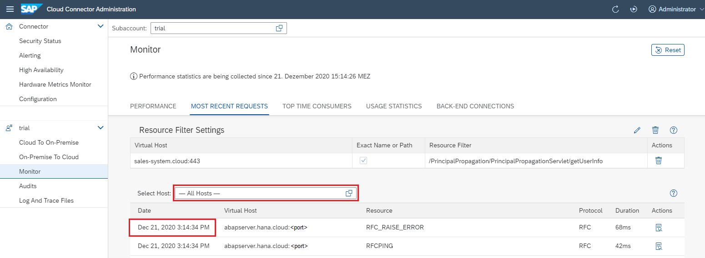
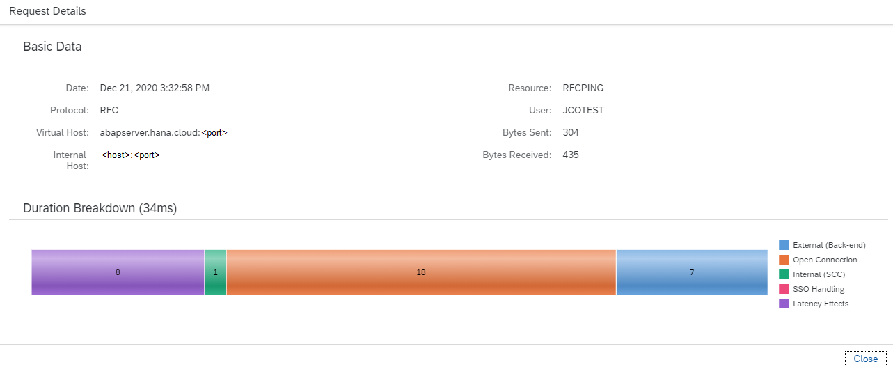
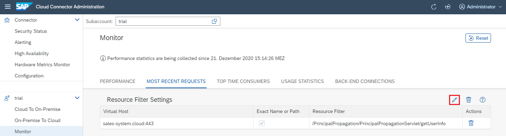
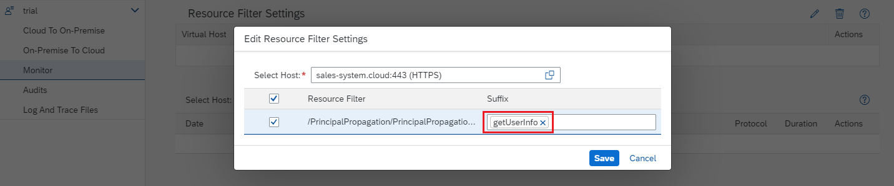
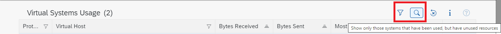

<!-- loioec3c3d754deb4134a697734555f14dca -->

# Monitoring \(Cloud to On-Premise\)

Monitor cloud to on-premise connections in the Cloud Connector.

<a name="loioec3c3d754deb4134a697734555f14dca__content"/>

## Content

[Performance Overview](monitoring-cloud-to-on-premise-ec3c3d7.md#loioec3c3d754deb4134a697734555f14dca__performance)

[Most Recent Requests](monitoring-cloud-to-on-premise-ec3c3d7.md#loioec3c3d754deb4134a697734555f14dca__mostRecent)

[Resource Filter Settings](monitoring-cloud-to-on-premise-ec3c3d7.md#loioec3c3d754deb4134a697734555f14dca__resource)

[Top Time Consumers](monitoring-cloud-to-on-premise-ec3c3d7.md#loioec3c3d754deb4134a697734555f14dca__top)

[Usage Statistics](monitoring-cloud-to-on-premise-ec3c3d7.md#loioec3c3d754deb4134a697734555f14dca__usage)

[Backend Connections](monitoring-cloud-to-on-premise-ec3c3d7.md#loioec3c3d754deb4134a697734555f14dca__backend)

<a name="loioec3c3d754deb4134a697734555f14dca__performance"/>

## Performance Overview

All requests that travel through the Cloud Connector to a backend system, as specified through access control, take a certain amount of time. You can check the duration of requests in a bar chart. The requests are not shown individually, but are assigned to buckets, each of which represents a time range.

For example, the first bucket contains all requests that took 10ms or less, the second one the requests that took longer than 10ms, but not longer than 20ms. The last bucket contains all requests that took longer than 5000ms.

In case of latency gaps, you may try to adjust the influencing parameters: number of connections, tunnel worker threads, and protocol processor worker threads. For more information, see [Configuration Setup](configuration-setup-7437cd6.md).

The collection of duration statistics starts as soon as the Cloud Connector is operational. You can delete all of these statistical records by selecting the button *Delete All*. After that, the collection of duration statistics starts over.

> ### Note:  
> *Delete All* deletes not only the list of most recent requests, but it also clears the top time consumers.

Back to [Content](monitoring-cloud-to-on-premise-ec3c3d7.md#loioec3c3d754deb4134a697734555f14dca__content)

<a name="loioec3c3d754deb4134a697734555f14dca__mostRecent"/>

## Most Recent Requests

This option shows the most recent requests:

The number of requests that are shown is limited to 50. You can either view all requests or only the ones destined for a certain virtual host, which you can select.You can select a row to see more detail.

A horizontal stacked bar chart breaks down the duration of the request into several parts: external \(backend\), open connection, internal \(Cloud Connector\), SSO handling, and latency effects \(between SAP BTP and Cloud Connector\). The numbers in each part represent milliseconds.

> ### Note:  
> Sections with a duration of less than 1ms are not included.

In the above example, the selected request took 34ms, to which the Cloud Connector contributed 1ms. Opening a connection took 18ms. Backend processing consumed 7ms. Latency effects accounted for the remaining 8ms, while there was no SSO handling necessary and hence it took no time at all.

> ### Note:  
> The term "request" only refers to RFC and HTTP requests. TCP or LDAP traffic does not contribute to *Most Recent Requests* or *Top Time Consumers*.

Back to [Content](monitoring-cloud-to-on-premise-ec3c3d7.md#loioec3c3d754deb4134a697734555f14dca__content)

<a name="loioec3c3d754deb4134a697734555f14dca__resource"/>

## Resource Filter Settings

To further restrict the selection of the listed 50 most recent requests, you can edit the resource filter settings for each virtual host:

In the *Edit* dialog, select the virtual host for which you want to specify the resource filter and choose one or more of the listed accessible resources. This list includes all resources that have been exposed during access control configuration \(see also: [Configure Access Control](configure-access-control-f42fe44.md)\). If the access policy for an accessible resource is set to `Path and all sub-paths`, you can further narrow the selection by adding one or more sub-paths to the resource as a suffix .

Each selected resource/sub-path is listed separately in the resource filter list.

> ### Note:  
> If you specify sub-paths for a resource, the request URL must match exactly one of these entries to be recorded. Without specified sub-paths \(and the value `Path and all sub-paths` set for a resource\), all sub-paths of a specified resource are recorded.

Back to [Content](monitoring-cloud-to-on-premise-ec3c3d7.md#loioec3c3d754deb4134a697734555f14dca__content)

<a name="loioec3c3d754deb4134a697734555f14dca__top"/>

## Top Time Consumers

This option is similar to *Most Recent Requests*; however, requests are not shown in order of appearance, but rather sorted by their duration \(in descending order\). Furthermore, you can delete top time consumers, which has no effect on most recent requests or the performance overview.

Back to [Content](monitoring-cloud-to-on-premise-ec3c3d7.md#loioec3c3d754deb4134a697734555f14dca__content)

<a name="loioec3c3d754deb4134a697734555f14dca__usage"/>

## Usage Statistics

To view the statistical data regarding the traffic handled by each **virtual host**, you can select a virtual host from the table. The detail view shows the traffic handled by *each resource*, as well as a *24 hour overview* of the throughput as a bar chart that aggregates the throughput \(bytes received and bytes sent by a virtual host, respectively\) on an hourly basis.

> ### Note:  
> For communication via HTTP and RFC, also the number of calls or requests is recorded in the same way.

The data that is collected includes the number of bytes received *from* cloud applications and the number of bytes sent back *to* cloud applications. The time of the most recent access is shown for the virtual hosts, and in the detail view also for the resources. If no access has taken place yet, the most recent access is shown as `n.a.` \(not available\). Similarly, the number of bytes received and sent of a virtual host is the sum of bytes received and sent of its resources.

The tables listing usage statistics of virtual hosts and their resources let you delete unused virtual hosts or unused resources. Use action *Delete* to delete such a virtual host or resource.

> ### Caution:  
> In Cloud Connector versions **before 2.14**, usage statistics are collected during runtime only and are not stored when stopping the Cloud Connector. That is, these statistics are lost when the Cloud Connector is stopped or restarted. Use care when taking the decision to delete a resource or virtual host based on its usage statistics.
> 
> **As of version 2.14**, usage statistics are periodically stored to disk. The collected statistics are still available after a restart of the Cloud Connector.
> 
> Actively deleted statistics are gone in either case.
> 
> A backup of the Cloud Connector settings does not include collected usage data. After restoring a Cloud Connector instance, all monitoring collections are empty.

Using the *Reset* button, you can clean up all collected data.

> ### Caution:  
> Statistical data will be deleted permanently.

For both virtual hosts and resources, you can use a classic *Filter* button to reduce the virtual hosts or resources to those that have never been used \(since the Cloud Connector started\). For the virtual hosts, a second filter type is available that selects only those virtual hosts that have been used, but *include resources never used*. This feature facilitates locating obsolete resources of otherwise active virtual hosts.

Back to [Content](monitoring-cloud-to-on-premise-ec3c3d7.md#loioec3c3d754deb4134a697734555f14dca__content)

<a name="loioec3c3d754deb4134a697734555f14dca__backend"/>

## Backend Connections

This option shows a tabular overview of all active and idle connections, aggregated for each virtual host. By selecting a row \(each of which represents a virtual host\) you can view the details of all active connections as well as a graphical summary of all idle connections. The graphical summary is an accumulative view of connections based on the time the connections have been idle.

The maximum idle time appears on the rightmost side of the horizontal axis. For any point `t` on that axis \(representing a time value ranging between 0ms and the maximal idle time\), the ordinate is the number of connections that have been idle for no longer than `t`. You can click inside the graph area to view the respective abscissa `t` and ordinate.

Back to [Content](monitoring-cloud-to-on-premise-ec3c3d7.md#loioec3c3d754deb4134a697734555f14dca__content)

