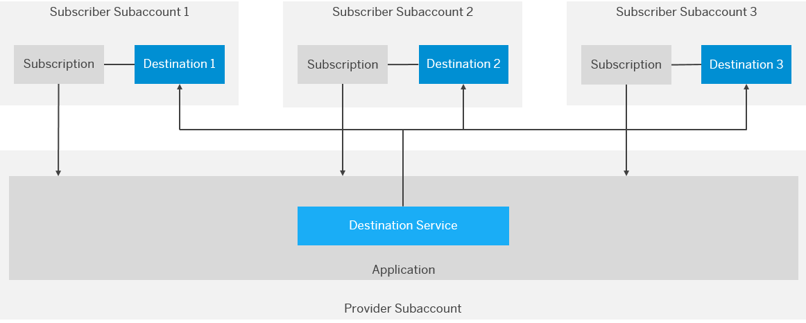

<!-- loio4e07f250fe5d441cab09f69e22909198 -->

# Multitenancy in the Destination Service

Establilsh multitenancy in the Destination service using subscription-level destinations.


<a name="loio4e07f250fe5d441cab09f69e22909198__concept"/>

## Concept

When developing a provider application \(SaaS application\) that consumes the Destination service, you can choose between the following destination levels:


<table>
<tr>
<th valign="top">

Level

</th>
<th valign="top">

Who has Access and How?

</th>
</tr>
<tr>
<td valign="top">

`Subaccount` 

</td>
<td valign="top">

*Any* application using *any* destination service instance in the subaccount context. This is the common level for all applications and service instances in the subaccount.

</td>
</tr>
<tr>
<td valign="top">

`Service Instance` 

</td>
<td valign="top">

Any application using the concrete destination service instance in the context of the *provider* subaccount \(the subaccount in which the instance is provisioned\). Each service instance has its own level.

</td>
</tr>
<tr>
<td valign="top">

`Subscription` 

</td>
<td valign="top">

*Any* application using the *concrete* destination service instance in the context of the *subscribed* subaccount. Each combination of service instance and subscriber subaccount is a unique level.

</td>
</tr>
</table>

> ### Note:  
> The term *level* is used here to represent an area or visibility scope. The higher the level, the broader is the visibility scope.

If you, as an application provider, want to create a destination that is used at runtime *only by the subscriber* and that should be *visible and accessible only to the subscriber*, you can create a subscription-level destination for each subscriber subaccount \(tenant\):



[Create a Subscription-Level Destination](multitenancy-in-the-destination-service-4e07f25.md#loio4e07f250fe5d441cab09f69e22909198__create) 

[Consume a Subscription-Level Destination](multitenancy-in-the-destination-service-4e07f25.md#loio4e07f250fe5d441cab09f69e22909198__consume) 


<a name="loio4e07f250fe5d441cab09f69e22909198__create"/>

## Create a Subscription-Level Destination

1.  Retrieve an OAuth token from the subscriber token service URL using the OAuth client credentials from the destination service instance, for example:

    ```
    POST https://{subscriber subdomain}.authentication.{region host}/oauth/token
    ```

2.  Use the retrieved token from step 1 to create \(`POST`\) a subscription-level destination in the Destination service, see *Destinations on service instance \(subscription\) level* in the [REST API specification](https://api.sap.com/api/SAP_CP_CF_Connectivity_Destination/resource).

[Back to Concept](multitenancy-in-the-destination-service-4e07f25.md#loio4e07f250fe5d441cab09f69e22909198__concept)


<a name="loio4e07f250fe5d441cab09f69e22909198__consume"/>

## Consume a Subscription-Level Destination

1.  Retrieve an OAuth token from the subscriber token service URL using the OAuth client credentials from the destination service instance, for example:

    ```
    POST https://{subscriber subdomain}.authentication.{region host}/oauth/token
    ```

2.  Use the token from step 1 to retrieve \(`GET`\) the destination stored on subscription level from the Destination service via:
    -   *Find a destination* in the [REST API specification](https://api.sap.com/api/SAP_CP_CF_Connectivity_Destination/resource)

    -   *Destinations on service instance \(subscription\) level* in the [REST API specification](https://api.sap.com/api/SAP_CP_CF_Connectivity_Destination/resource)


[Back to Concept](multitenancy-in-the-destination-service-4e07f25.md#loio4e07f250fe5d441cab09f69e22909198__concept)

**Related Information**  


[Multitenancy in the Connectivity Service](multitenancy-in-the-connectivity-service-9c0bdd0.md "Using multitenancy for Cloud Foundry applications that require a connection to a remote service or on-premise application.")

