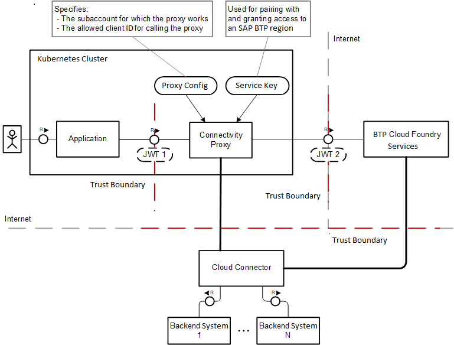
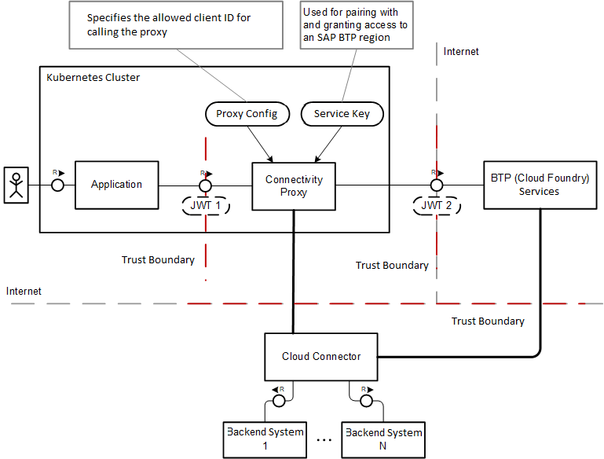
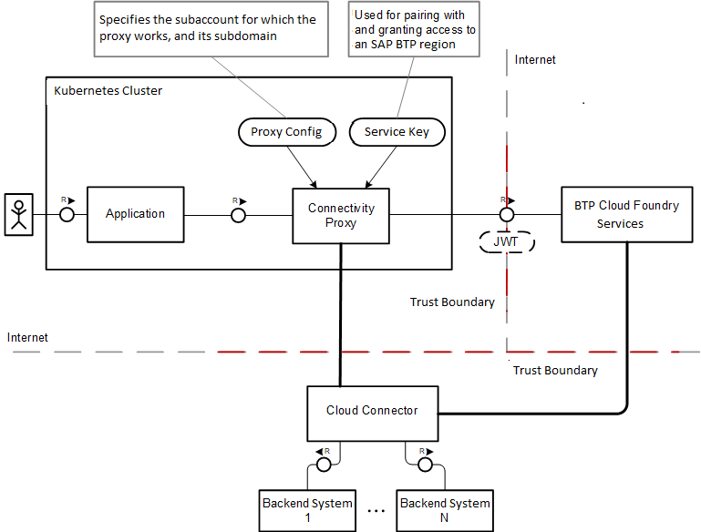
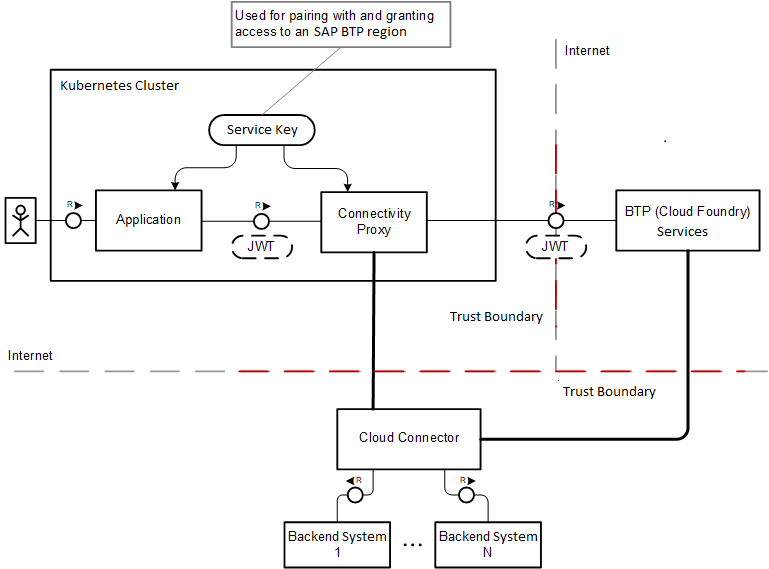

<!-- loio148bbad274e545efa10de8a356dd474d -->

# Operational Modes

Learn about the different operational modes of the connectivity proxy for Kubernetes.

The connectivity proxy can run in four different operational modes, based on two main categories:

-   Trust for the surrounding environment and the callers of the proxy
-   Tenant usage of the proxy

Find below the details for each operational mode:

[Single-Tenant Usage: *Non-Trusted* Environment](operational-modes-148bbad.md#loio148bbad274e545efa10de8a356dd474d__singleNon)

[Multi-Tenant Usage: *Non-Trusted* Environment](operational-modes-148bbad.md#loio148bbad274e545efa10de8a356dd474d__multiNon)

[Single-Tenant Usage: *Trusted* Environment](operational-modes-148bbad.md#loio148bbad274e545efa10de8a356dd474d__single)

[Multi-Tenant Usage: *Trusted* Environment](operational-modes-148bbad.md#loio148bbad274e545efa10de8a356dd474d__multi)

<a name="loio148bbad274e545efa10de8a356dd474d__singleNon"/>

## Single-Tenant Usage: *Non-Trusted* Environment

The connectivity proxy operates on behalf of a single, statically configured tenant. Applications cannot be trusted. The connectivity proxy is configured as follows:

-   Proxy authorization is *enabled*.
-   Tenant mode is *dedicated*.
-   Uses a statically configured service key of the `connectivity_proxy` service instance of the `connectivity` service.
-   Connects to the central Connectivity service on behalf of the statically configured tenant.

[Back to Top](operational-modes-148bbad.md#loio148bbad274e545efa10de8a356dd474d__top)

<a name="loio148bbad274e545efa10de8a356dd474d__multiNon"/>

## Multi-Tenant Usage: *Non-Trusted* Environment

The connectivity proxy operates on behalf of multiple tenants. Applications cannot be trusted. The connectivity proxy is configured as follows:

-   Proxy authorization is *enabled*.
-   Tenant mode is *shared*.
-   Uses a statically configured service key of the `connectivity_proxy` service instance of the `connectivity` service.
-   Connects to the central Connectivity service on behalf of the dynamically determined tenant, based on the OAuth access token \(JWT\) forwarded by the application.

[Back to Top](operational-modes-148bbad.md#loio148bbad274e545efa10de8a356dd474d__top)

<a name="loio148bbad274e545efa10de8a356dd474d__single"/>

## Single-Tenant Usage: *Trusted* Environment

The connectivity proxy operates on behalf of a single, statically configured tenant. Applications are trusted. The connectivity proxy is configured as follows:

-   Proxy authorization is *disabled*.
-   Tenant mode is *dedicated*.
-   Uses a statically configured service key of the `connectivity_proxy` service instance of the `connectivity` service.
-   Connects to the central Connectivity service on behalf of the statically configured tenant.

[Back to Top](operational-modes-148bbad.md#loio148bbad274e545efa10de8a356dd474d__top)

<a name="loio148bbad274e545efa10de8a356dd474d__multi"/>

## Multi-Tenant Usage: *Trusted* Environment

The connectivity proxy operates on behalf of multiple tenants. Applications are trusted. Applications use service keys of the `connectivity_proxy` service instance of the `connectivity` service. The connectivity proxy is configured as follows:

-   Proxy authorization is *disabled*.
-   Tenant mode is *shared*.
-   Connects to the central Connectivity service on behalf of the dynamically determined tenant, using the OAuth access token \(JWT\) forwarded by the application.

[Back to Top](operational-modes-148bbad.md#loio148bbad274e545efa10de8a356dd474d__top)

**Related Information**  

[Installing the Connectivity Proxy in Multi-Region Mode](installing-the-connectivity-proxy-in-multi-region-mode-72072ca.md "Use a single connectivity proxy installation for your global account.")

