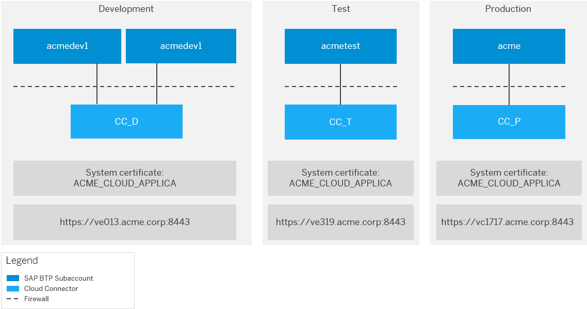

<!-- loiocfc2c6b1271147ef8bee6c6887945ebd -->

# Process Guidelines for Hybrid Scenarios

A hybrid scenario is one, in which applications running on SAP BTP require access to on-premise systems. Define and document your scenario to get an overview of the required process steps.

<a name="loiocfc2c6b1271147ef8bee6c6887945ebd__tasks"/>

## Tasks

[Document the Landscape of a Hybrid Solution](process-guidelines-for-hybrid-scenarios-cfc2c6b.md#loiocfc2c6b1271147ef8bee6c6887945ebd__landscape)

[Document Administrator Roles](process-guidelines-for-hybrid-scenarios-cfc2c6b.md#loiocfc2c6b1271147ef8bee6c6887945ebd__roles)

[Document Communication Channels](process-guidelines-for-hybrid-scenarios-cfc2c6b.md#loiocfc2c6b1271147ef8bee6c6887945ebd__channels)

[Define Project and Development Guidelines](process-guidelines-for-hybrid-scenarios-cfc2c6b.md#loiocfc2c6b1271147ef8bee6c6887945ebd__guidelines)

[Define How to Set a Cloud Application Live](process-guidelines-for-hybrid-scenarios-cfc2c6b.md#loiocfc2c6b1271147ef8bee6c6887945ebd__live)

<a name="loiocfc2c6b1271147ef8bee6c6887945ebd__landscape"/>

## Document the Landscape of a Hybrid Solution

To gain an overview of the cloud and on-premise landscape that is relevant for your hybrid scenario, we recommend that you diagrammatically document your cloud subaccounts, their connected Cloud Connectors and any on-premise back-end systems. Include the subaccount names, the purpose of the subaccounts \(dev, test, prod\), information about the Cloud Connector machines \(host, domains\), the URLs of the Cloud Connectors in the landscape overview document, and any other details you might find useful to include.

An example of landscape overview documentation could look like this:

Back to [Tasks](process-guidelines-for-hybrid-scenarios-cfc2c6b.md#loiocfc2c6b1271147ef8bee6c6887945ebd__tasks)

<a name="loiocfc2c6b1271147ef8bee6c6887945ebd__roles"/>

## Document Administrator Roles

Document the users who have administrator access to the cloud subaccounts, to the Cloud Connector operating system, and to the Cloud Connector administration UI.

Such an administrator role documentation could look like following sample table:

<table>
<tr>
<th valign="top">

Resource

</th>
<th valign="top">

bernardo@acme.com

</th>
<th valign="top">

mary@acme.com

</th>
<th valign="top">

smitha@acme.com

</th>
<th valign="top">

greg@acme.com

</th>
</tr>
<tr>
<td valign="top">

Cloud Subaccount \(CA\) Dev1

</td>
<td valign="top">

X

</td>
<td valign="top">

 

</td>
<td valign="top">

 

</td>
<td valign="top">

 

</td>
</tr>
<tr>
<td valign="top">

CA Dev2

</td>
<td valign="top">

 

</td>
<td valign="top">

X

</td>
<td valign="top">

 

</td>
<td valign="top">

 

</td>
</tr>
<tr>
<td valign="top">

CA Test

</td>
<td valign="top">

 

</td>
<td valign="top">

 

</td>
<td valign="top">

X

</td>
<td valign="top">

X

</td>
</tr>
<tr>
<td valign="top">

CA Prod

</td>
<td valign="top">

 

</td>
<td valign="top">

 

</td>
<td valign="top">

 

</td>
<td valign="top">

X

</td>
</tr>
<tr>
<td valign="top">

Cloud Connector Dev1 + Dev2

</td>
<td valign="top">

X

</td>
<td valign="top">

X

</td>
<td valign="top">

 

</td>
<td valign="top">

 

</td>
</tr>
<tr>
<td valign="top">

Cloud Connector Test

</td>
<td valign="top">

 

</td>
<td valign="top">

 

</td>
<td valign="top">

X

</td>
<td valign="top">

X

</td>
</tr>
<tr>
<td valign="top">

Cloud Connector Prod

</td>
<td valign="top">

 

</td>
<td valign="top">

 

</td>
<td valign="top">

 

</td>
<td valign="top">

X

</td>
</tr>
<tr>
<td valign="top">

Cloud Connector Dev1 + Dev2 file system

</td>
<td valign="top">

 

</td>
<td valign="top">

 

</td>
<td valign="top">

X

</td>
<td valign="top">

X

</td>
</tr>
<tr>
<td valign="top">

Cloud Connector Test file system

</td>
<td valign="top">

 

</td>
<td valign="top">

 

</td>
<td valign="top">

 

</td>
<td valign="top">

X

</td>
</tr>
<tr>
<td valign="top">

Cloud Connector Prod file system

</td>
<td valign="top">

 

</td>
<td valign="top">

 

</td>
<td valign="top">

 

</td>
<td valign="top">

 

</td>
</tr>
</table>

Back to [Tasks](process-guidelines-for-hybrid-scenarios-cfc2c6b.md#loiocfc2c6b1271147ef8bee6c6887945ebd__tasks)

<a name="loiocfc2c6b1271147ef8bee6c6887945ebd__channels"/>

## Document Communication Channels

Create and document separate email distribution lists for both the cloud subaccount administrators and the Cloud Connector administrators.

An example of the documented communication channels could look like this:

<table>
<tr>
<th valign="top">

Landscape

</th>
<th valign="top">

Distribution List

</th>
</tr>
<tr>
<td valign="top">

Cloud Subaccount Administrators

</td>
<td valign="top">

DL ACME BTP Subaccount Admins

</td>
</tr>
<tr>
<td valign="top">

Cloud Connector Administrators

</td>
<td valign="top">

DL ACME Cloud Connector Admins

</td>
</tr>
</table>

Back to [Tasks](process-guidelines-for-hybrid-scenarios-cfc2c6b.md#loiocfc2c6b1271147ef8bee6c6887945ebd__tasks)

<a name="loiocfc2c6b1271147ef8bee6c6887945ebd__guidelines"/>

## Define Project and Development Guidelines

Define and document mandatory project and development guidelines for your SAP BTP projects. An example of such a guideline could be similar to the following.

Every SAP BTP project in this organization requires the following:

-   Use Maven, Nexus, Git-&-Gerrit for the application development.
-   Align with accountable manager in projects \(including the names\).
-   Align with accountable security officer in projects \(including the names\).
-   For externally developed source code, an official handover to the organization.
-   Fulfill connection restrictions in a three-system landscape, that is, use a staged landscape for dev, test and prod, and, for example, the dev landscape connects only to dev systems, and so on.
-   Productive subaccounts cannot use the same Cloud Connector as a dev or test subaccount.

Back to [Tasks](process-guidelines-for-hybrid-scenarios-cfc2c6b.md#loiocfc2c6b1271147ef8bee6c6887945ebd__tasks)

<a name="loiocfc2c6b1271147ef8bee6c6887945ebd__live"/>

## Define How to Set a Cloud Application Live

Define and document how to set a cloud application live and how to configure needed connectivity for such an application.

For example, the following processes could be seen as relevant and should be defined and document in more detail:

1.  Transferring application to production: Steps for transferring an application to the productive status on the SAP BTP.
2.  Application connectivity: The steps for adding a connectivity destination to a deployed application for connections to other resources in the test or productive landscape.
3.  Cloud Connector Connectivity: Steps for adding an on-premise resource to the Cloud Connector in the test or productive landscapes to make it available for the connected cloud subaccounts.
4.  On-premise system connectivity: The steps for setting up a trusted relationship between an on-premise system and the Cloud Connector, and to configure user authentication and authorization in the on-premise system in the test or productive landscapes.
5.  Application authorization: The steps for requesting and assigning an authorization that is available inside the SAP BTP application to a user in the test or productive landscapes.
6.  Administrator permissions: Steps for requesting and assigning the administrator permissions in a cloud subaccount to a user in the test or productive landscape.

Back to [Tasks](process-guidelines-for-hybrid-scenarios-cfc2c6b.md#loiocfc2c6b1271147ef8bee6c6887945ebd__tasks)

