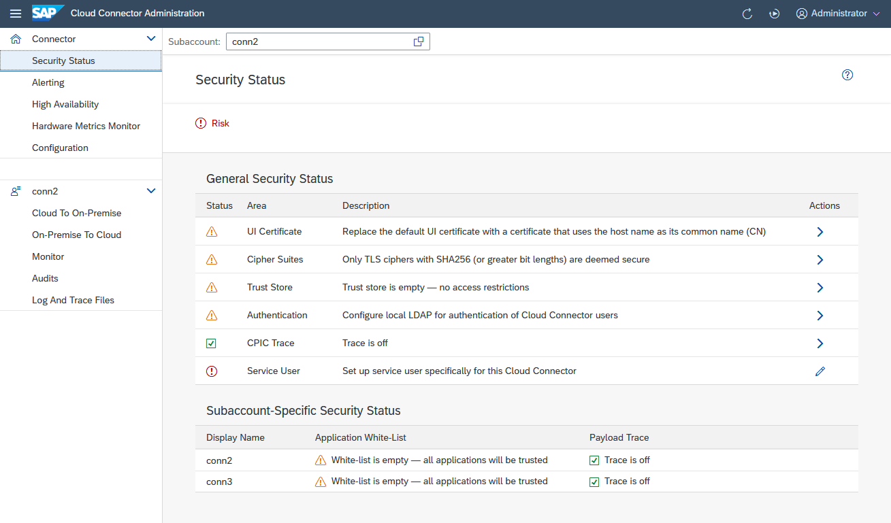
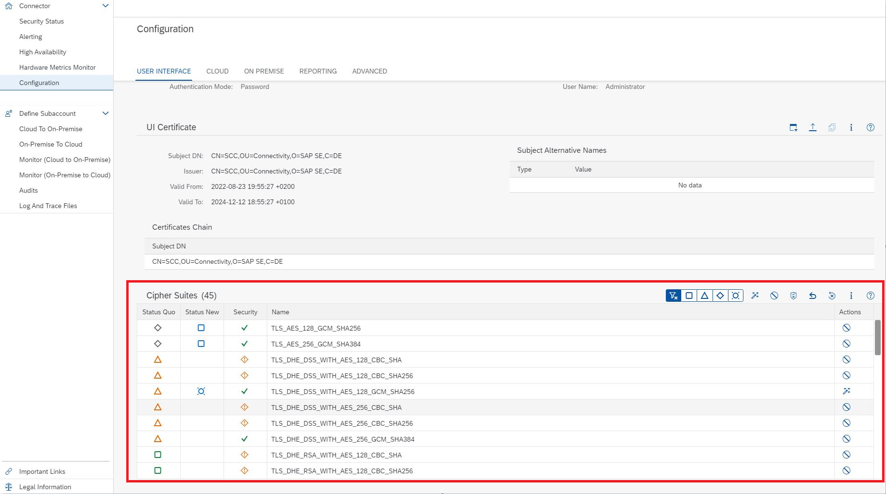

<!-- loioe7ea82a4bb571014a4ceb61cb7e3d31f -->

# Recommendations for Secure Setup

For the Connectivity service and the Cloud Connector, you should apply the following guidelines to guarantee the highest level of security for these components.

<a name="loioe7ea82a4bb571014a4ceb61cb7e3d31f__section_4031A6F74E6B49F7BF37E118C83AC6A2"/>

## Security Status

From the *Connector* menu, choose *Security Status* to access an overview showing potential security risks and the recommended actions.

The *General Security Status* addresses security topics that are subaccount-independent.

-   Choose any of the *Actions* icons in the corresponding line to navigate to the UI area that deals with that particular topic and view or edit details.

    > ### Note:  
    > Navigation is not possible for the last item in the list \(*Service User*\).

-   The service user is specific to the Windows operating system \(see [Installation on Microsoft Windows OS](installation-on-microsoft-windows-os-204aaad.md) for details\) and is only visible when running the Cloud Connector on Windows. It cannot be accessed or edited through the UI. If the service user was set up properly, choose *Edit* and check the corresponding checkbox.

The *Subaccount-Specific Security Status* lists security-related information for each and every subaccount.

> ### Note:  
> The security status only serves as a reminder to address security issues and shows if your installation complies with all recommended security settings.

<a name="loioe7ea82a4bb571014a4ceb61cb7e3d31f__section_D4D13AAA27974C84897D87319996AC65"/>

## UI Access

Upon installation, the Cloud Connector provides an initial user name and password for the administration UI, and forces the user \(`Administrator`\) to change the password. You must change the password immediately after installation.

The connector itself does not check the strength of the password. You should select a strong password that cannot be guessed easily.

> ### Note:  
> To enforce your company's password policy, we recommend that you configure the Administration UI to use an LDAP server for authorizing access to the UI.

The default user store is a local file store. It allows only one user, and only the *Administrator* role for this user. Using an LDAP server as user store lets you create various users to access the UI, and assign different roles to them. For more information on available roles, see [Use LDAP for User Administration](use-ldap-for-user-administration-120ceec.md).

The Cloud Connector administration UI can be accessed remotely via HTTPS. The connector uses a standard X.509 self-signed certificate as SSL server certificate. You can exchange this certificate with a specific certificate that is trusted by your company. See [Exchange UI Certificates in the Administration UI](exchange-ui-certificates-in-the-administration-ui-b70bf16.md).

> ### Note:  
> Since browsers usually do not resolve *localhost* to the host name whereas the certificate usually is created under the host name, you might get a certificate warning. In this case, simply skip the warning message.

<a name="loioe7ea82a4bb571014a4ceb61cb7e3d31f__section_1B269F204315446B9885046859490CE4"/>

## OS-Level Access

The Cloud Connector is a security-critical component that handles the external access to systems of an isolated network, comparable to a reverse proxy. We therefore recommend that you restrict the access to the operating system on which the Cloud Connector is installed to the minimal set of users who would administrate the Cloud Connector. This minimizes the risk of unauthorized users getting access to credentials, such as certificates stored in the secure storage of the Cloud Connector.

We also recommend that you use the machine to operate only the Cloud Connector and no other systems.

<a name="loioe7ea82a4bb571014a4ceb61cb7e3d31f__section_C94B6BF6BCB94C9A9190B601D554BA3D"/>

## Administrator Privileges

To log on to the Cloud Connector administration UI, the `Administrator` user of the connector must not have an operating system \(OS\) user for the machine on which the connector is running. This allows the OS administrator to be distinguished from the Cloud Connector administrator. To make an initial connection between the connector and a particular SAP BTP subaccount, you need an SAP BTP user with the required permissions for the related subaccount. We recommend that you separate these roles/duties \(that means, you have separate users for Cloud Connector administrator and SAP BTP\).

> ### Note:  
> We recommend that only a small number of users are granted access to the machine as *root* users.

<a name="loioe7ea82a4bb571014a4ceb61cb7e3d31f__section_F47A19D58D044F219871079D800EAB8D"/>

## Hard Drive Encryption

Hard drive encryption for machines with a Cloud Connector installation ensures that the Cloud Connector configuration data cannot be read by unauthorized users, even if they obtain access to the hard drive.

<a name="loioe7ea82a4bb571014a4ceb61cb7e3d31f__section_93C51D867A5C472B90D6C343487647FD"/>

## Supported Protocols

Currently, the protocols HTTP, HTTPS, RFC, RFC with SNC, LDAP, LDAPS, TCP, and TCP over TLS are supported for connections between the SAP BTP and on-premise systems when the Cloud Connector and the Connectivity service are used. The whole route from the application virtual machine in the cloud to the Cloud Connector is always SSL-encrypted.

The route from the connector to the back-end system can be TLS-encrypted or SNC-encrypted. See [Configure Access Control \(HTTP\)](configure-access-control-http-e7d4927.md) and [Configure Access Control \(RFC\)](configure-access-control-rfc-ca58689.md).

## Audit Log on OS Level

We recommend that you turn on the audit log on operating system level to monitor the file operations.

<a name="loioe7ea82a4bb571014a4ceb61cb7e3d31f__section_1547D9616881441682ED9C1313FB6DE0"/>

## Audit Log on Cloud Connector Level

The Cloud Connector audit log must remain switched on during the time it is used with productive systems. The default audit level is `SECURITY`. Set it to `ALL` if required by your company policy. The administrators who are responsible for a running Cloud Connector must ensure that the audit log files are properly archived, to conform to the local regulations. You should switch on audit logging also in the connected back-end systems.

<a name="loioe7ea82a4bb571014a4ceb61cb7e3d31f__encryption_ciphers"/>

## Encryption Ciphers

> ### Tip:  
> Enable all cipher suites that are compatible with the current UI certificate and are deemed secure as per your company's and SAP's guidelines. Adapt the cipher suites whenever the UI certificate is exchanged or the JVM is updated.

Initially, a default set of encryption ciphers is enabled for HTTPS connections to the administration UI. This default set is determined by the JVM. Some of these ciphers may not be compliant with the UI certificate, and some of them may not conform to your or SAP's security standards. They should therefore be excluded.

To enable or disable ciphers, choose *Configuration* from the main menu and go to tab *User Interface*, section *Cipher Suites*.

The first column labeled **Status Quo** shows the current state of all available ciphers. The second column **Status New** shows the state the ciphers will have after a restart, if that state differs from the current one \(that is, there is no entry in that column if the state remains the same after a restart\).

Ciphers are either enabled or disabled, and they are either compatible or incompatible with the current UI certificate \(that is, can potentially be used or not be used\) . Consult the tooltips of the \(four types of\) icons for details. The third column shows SAP's security assessment of the ciphers *as per the time of release*. Enable or disable individual ciphers using the button in the **Action** column. Enable or disable certain groups of ciphers using the appropriate table button. Consult the tooltips for details.

> ### Note:  
> We recommend that you enable all cipher suites that are compatible with the UI whenever you plan to switch to another JVM. You can comfortably do so by using the first button to the right of the filter buttons.
> 
> As the set of supported ciphers may differ, the selected ciphers may not be supported by the new JVM. In that case, the Cloud Connector will not start anymore, and you must fix the issue by manually adapting the file *conf/server.xml*. After a successful switch, you can adjust the list of eligible ciphers again.

> ### Tip:  
> As of Cloud Connector version 2.17.0, you can run the script `resetCiphers` from the `scc` folder in the Cloud Connector installation directory to reset the ciphers if UI access is blocked due to wrong cipher settings.

**Related Information**  

[Connectivity via Reverse Proxy](connectivity-via-reverse-proxy-dde01af.md "The text discusses the use of a reverse proxy as an alternative approach to connect on-premise services to SAP BTP. While it allows for reuse of existing network infrastructure, it exposes services to potential attacks and requires significant involvement from your IT department. The Cloud Connector is recommended as a more secure and efficient solution, providing TLS tunneling and fine-grained access control.")

[Security](security-cb50b61.md "Learn how Cloud Connector features help you manage security.")

