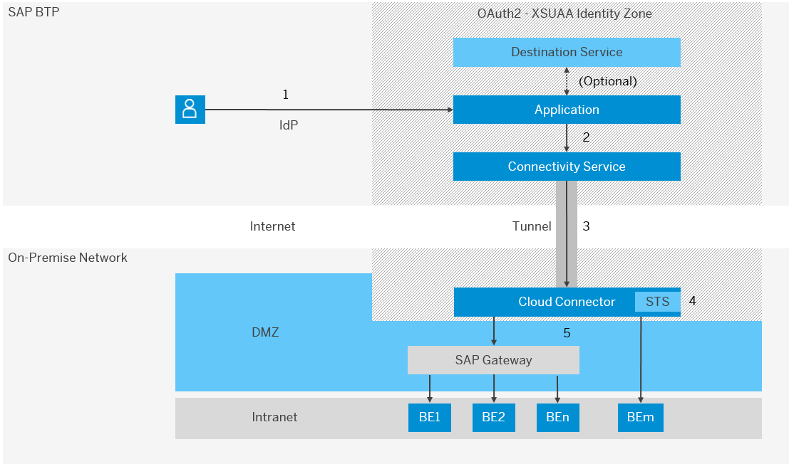

<!-- loio70b8ef33812e486d8b745a0b47fd093e -->

# Scenario: Cloud to On-Premise

Forward the identity of cloud users from the Cloud Foundry environment to on-premise systems using principal propagation.

## Concept

The Connectivity service lets you connect your cloud applications to on-premise systems through the Cloud Connector and forward the identity of a cloud user. This process is called principal propagation \(also known as user propagation\). The JSON Web token \(JWT\) representing the cloud user identity is forwarded to the Cloud Connector, which verifies it, and propagates the user identity via either an X.509 certificate or Kerberos.

Optionally, you can configure and use a destination configuration by setting the authentication type as `PrincipalPropagation`. For more information, see [Managing Destinations](managing-destinations-84e45e0.md).

> ### Note:  
> This scenario is only applicable if the on-premise system is exposed to the cloud via the Cloud Connector.

You can configure principal propagation for HTTP or RFC communication.

<a name="loio70b8ef33812e486d8b745a0b47fd093e__how"/>

## Scenario: Cloud to On-Premise

1.  A user logs in to the cloud application. Its identity is established by an identity provider \(this can be the default IdP for the subaccount or another trusted IdP\).
2.  The cloud application then uses a user exchange token \(or a designated secondary header\) to propagate the user to the Connectivity service. See also [Configure Principal Propagation via User Exchange Token](configure-principal-propagation-via-user-exchange-token-39f538a.md).
    -   Optionally, the application may use the Destination service to externalize the connection configuration that points to the target on-premise system. See also [Consuming the Destination Service](consuming-the-destination-service-7e30625.md).

    -   If you are using RFC as communication protocol usa with the *SAP Java Buildpack*, this step is already done by the Java Connector \(JCo\).

3.  The Connectivity service forwards the JWT \(that represents the user\) to the Cloud Connector.
4.  The Cloud Connector receives the JWT, verifies it, extracts the attributes, and uses its STS \(security token service\) component to issue a new token \(for example, an X.509 certificate\) with the same or similar attributes to assert the identity to the backend \(BE1-BEm\). The Cloud Connector and the cloud application share the same trust settings, see [Set Up Trust](set-up-trust-a4ee70f.md).
5.  The Cloud Connector sends the new token \(for example, an X.509 certificate\) to the backend system.

<a name="loio70b8ef33812e486d8b745a0b47fd093e__steps_pp"/>

## Configuration: Cloud to On-Premise

<table>
<tr>
<th valign="top">

Task Type

</th>
<th valign="top">

Task

</th>
</tr>
<tr>
<td valign="top">

Operator

</td>
<td valign="top">

[Configuring Principal Propagation](configuring-principal-propagation-c84d4d0.md) \(Cloud Connector\)

</td>
</tr>
<tr>
<td valign="top">

Developer

</td>
<td valign="top">

Use cases:

-   HTTP communication: [Configure Principal Propagation via User Exchange Token](configure-principal-propagation-via-user-exchange-token-39f538a.md) \(Connectivity service\)
-   RFC communication: [Configure Principal Propagation for RFC](configure-principal-propagation-for-rfc-30c4168.md)

</td>
</tr>
</table>

