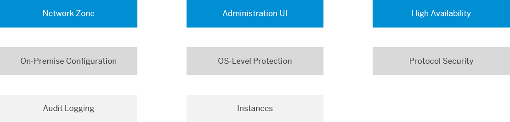

<!-- loio8db6945e70b44c5d8e0873c3e9fb3bf2 -->

# Security Guidelines

Find a checklist of recommended security measures for the Cloud Connector.

<a name="loio8db6945e70b44c5d8e0873c3e9fb3bf2__topics"/>

## Topics

Hover over the elements for a description. Click an element to find the recommended actions in the table below.

<a name="loio8db6945e70b44c5d8e0873c3e9fb3bf2__section_ukm_3f3_hgb"/>

## Recommended Actions

<table>
<tr>
<th valign="top">

Topic

</th>
<th valign="top">

Description

</th>
<th valign="top">

Recommended Action

</th>
</tr>
<tr>
<td valign="top">

*Network Zone*

Back to [Topics](security-guidelines-8db6945.md#loio8db6945e70b44c5d8e0873c3e9fb3bf2__topics)

</td>
<td valign="top">

Depending on the needs of the project, the Cloud Connector can be either set up in the **DMZ** and operated centrally by the IT department or set up in the **intranet** and operated by the line-of-business.

</td>
<td valign="top">

To access highly secure on-premise systems, operate the Cloud Connector centrally by the IT department and install it in the DMZ of the company network.

Set up trust between the on-premise system and the Cloud Connector, and only accept requests from trusted Cloud Connectors in the system.

</td>
</tr>
<tr>
<td valign="top" rowspan="4">

*OS-Level Protection*

Back to [Topics](security-guidelines-8db6945.md#loio8db6945e70b44c5d8e0873c3e9fb3bf2__topics)

</td>
<td valign="top" rowspan="4">

The Cloud Connector is a security-critical component that handles the inbound access from SAP BTP applications to systems of an on-premise network.

**Methods to secure the operating system**, on which the Cloud Connector is running, should be applied.

</td>
<td valign="top">

Restrict access to the operating system on which the Cloud Connector is installed to the minimal set of users who should administrate the Cloud Connector.

</td>
</tr>
<tr>
<td valign="top">

Use the machine which runs the Cloud Connector only for this purpose and don’t reuse it for other scenarios.

</td>
</tr>
<tr>
<td valign="top">

Use hard-drive encryption for the machine that runs the Cloud Connector. This ensures that the Cloud Connector configuration data cannot be read or modified by unauthorized users, even if they obtain access to the hard drive.

</td>
</tr>
<tr>
<td valign="top">

Turn on the audit log on operating system level to monitor the file operations.

</td>
</tr>
<tr>
<td valign="top" rowspan="5">

*Administration UI* 

Back to [Topics](security-guidelines-8db6945.md#loio8db6945e70b44c5d8e0873c3e9fb3bf2__topics)

</td>
<td valign="top" rowspan="2">

After installation, the Cloud Connector provides an initial user name and password and forces the user \(`Administrator`\) to **change the password** upon initial logon.

</td>
<td valign="top">

Change the password of the *Administrator* user immediately after installation. Choose a strong password for the user \(see also [Recommendations for Secure Setup](recommendations-for-secure-setup-e7ea82a.md)\).

</td>
</tr>
<tr>
<td valign="top">

Configure a corporate LDAP system for the user management of the Cloud Connector administrator users. This guarantees that users of the Cloud Connector administration UI are named users and can be traced via the Cloud Connector audit log \(see [Use LDAP for User Administration](use-ldap-for-user-administration-120ceec.md)\).

</td>
</tr>
<tr>
<td valign="top" rowspan="3">

You can access the Cloud Connector administration UI remotely via HTTPS.

After installation, it uses a self-signed **X.509 certificate** as SSL server certificate, which is not trusted by default by Web browsers.

</td>
<td valign="top">

Exchange the self-signed X.509 certificate of the Cloud Connector administration UI by a certificate that is trusted by your company and the company’s approved Web browser settings \(see [Exchange UI Certificates in the Administration UI](exchange-ui-certificates-in-the-administration-ui-b70bf16.md)\).

</td>
</tr>
<tr>
<td valign="top">

For high-security scenarios, limit the access to the Cloud Connector administration UI to localhost \(see also [Recommendations for Secure Setup](recommendations-for-secure-setup-e7ea82a.md)\).

</td>
</tr>
<tr>
<td valign="top">

Use a JVM that allows to limit the ciphers to a set considered safe \(see [Recommendations for Secure Setup](recommendations-for-secure-setup-e7ea82a.md)\). A list of cipher suites, which are currently considered safe, is available in [Use Secure Cipher Suites](https://github.com/ssllabs/research/wiki/SSL-and-TLS-Deployment-Best-Practices#23-use-secure-cipher-suites).

</td>
</tr>
<tr>
<td valign="top" rowspan="3">

*Audit Logging* 

Back to [Topics](security-guidelines-8db6945.md#loio8db6945e70b44c5d8e0873c3e9fb3bf2__topics)

</td>
<td valign="top" rowspan="3">

For end-to-end traceability of configuration changes in the Cloud Connector, as well as communication delivered by the Cloud Connector, **switch on audit logging** for productive scenarios.

</td>
<td valign="top">

Switch on audit logging in the Cloud Connector: set audit level to “All” \(see [Recommendations for Secure Setup](recommendations-for-secure-setup-e7ea82a.md) and [Manage Audit Logs](manage-audit-logs-2264c70.md)\)

</td>
</tr>
<tr>
<td valign="top">

Cloud Connector administrators must ensure that the audit log files are properly archived and are not lost, to conform to the local regulations.

</td>
</tr>
<tr>
<td valign="top">

To gain end-to-end traceability, you should switch on audit logging also in the connected on-premise systems.

</td>
</tr>
<tr>
<td valign="top">

*High Availability* 

Back to [Topics](security-guidelines-8db6945.md#loio8db6945e70b44c5d8e0873c3e9fb3bf2__topics)

</td>
<td valign="top">

To guarantee high availability of the connectivity for cloud integration scenarios, run productive instances of the Cloud Connector in high availability mode, that is, with a **second \(redundant\) Cloud Connector** in place.

</td>
<td valign="top">

Use the high availability feature of the Cloud Connector for productive scenarios \(see [Install a Failover Instance for High Availability](install-a-failover-instance-for-high-availability-c697705.md)\).

</td>
</tr>
<tr>
<td valign="top">

*Supported Protocols*

Back to [Topics](security-guidelines-8db6945.md#loio8db6945e70b44c5d8e0873c3e9fb3bf2__topics)

</td>
<td valign="top">

**HTTP**, **HTTPS**, **RFC** and **RFC over SNC** are currently supported as protocols for the communication direction from the cloud to on-premise.

The route from the application VM in the cloud to the Cloud Connector is always encrypted.

You can configure the route from the Cloud Connector to the on-premise system to be encrypted or unencrypted.

</td>
<td valign="top">

The route from the Cloud Connector to the on-premise system should be encrypted using TLS \(for HTTPS\) or SNC \(for RFC\).

Trust between the Cloud Connector and the connected on-premise systems should be established \(see [Set Up Trust](set-up-trust-a4ee70f.md)\).

</td>
</tr>
<tr>
<td valign="top" rowspan="3">

*Configuration of On-Premise Systems*

Back to [Topics](security-guidelines-8db6945.md#loio8db6945e70b44c5d8e0873c3e9fb3bf2__topics)

</td>
<td valign="top">

When configuring the access to an internal system in the Cloud Connector, map physical host names to virtual host names to **prevent exposure of information** on physical systems to the cloud.

</td>
<td valign="top">

Use hostname mapping of exposed on-premise systems in the access control of the Cloud Connector \(see [Configure Access Control \(HTTP\)](configure-access-control-http-e7d4927.md) and [Configure Access Control \(RFC\)](configure-access-control-rfc-ca58689.md)\).

</td>
</tr>
<tr>
<td valign="top">

When configuring the access to an internal system, **restrict access** to those resources which are actually required by the cloud applications. Do not expose the complete system.

</td>
<td valign="top">

Narrow access to on-premise systems to resources required by the relevant cloud applications in the access control of the Cloud Connector \(see [Configure Access Control \(HTTP\)](configure-access-control-http-e7d4927.md) and [Configure Access Control \(RFC\)](configure-access-control-rfc-ca58689.md)\).

</td>
</tr>
<tr>
<td valign="top">

To allow **access only for trusted applications** of your SAP BTP subaccount to on-premise systems, configure the list of trusted applications in the Cloud Connector.

</td>
<td valign="top">

Narrow the list of cloud applications which are allowed to use the on-premise tunnel to the ones that need on-premise connectivity \(see [Set Up Trust](set-up-trust-a4ee70f.md)\).

</td>
</tr>
<tr>
<td valign="top">

*Cloud Connector Instances*

Back to [Topics](security-guidelines-8db6945.md#loio8db6945e70b44c5d8e0873c3e9fb3bf2__topics)

</td>
<td valign="top">

You can connect a single Cloud Connector instance to multiple SAP BTP subaccounts.

Subaccounts can be created by SAP BTP users as a self service. Different subaccounts are often used to **separate development, test and production**.

Do not mix productive Cloud Connector usages with development or test scenarios.

</td>
<td valign="top">

Use different Cloud Connector instances to separate productive and non-productive scenarios.

</td>
</tr>
</table>

**Related Information**  

[Recommendations for Secure Setup](recommendations-for-secure-setup-e7ea82a.md "For the Connectivity service and the Cloud Connector, you should apply the following guidelines to guarantee the highest level of security for these components.")

[Secure the Activation of Traffic Traces](secure-the-activation-of-traffic-traces-4c8f678.md "For support purposes, you can trace HTTP and RFC network traffic that passes through the Cloud Connector.")

