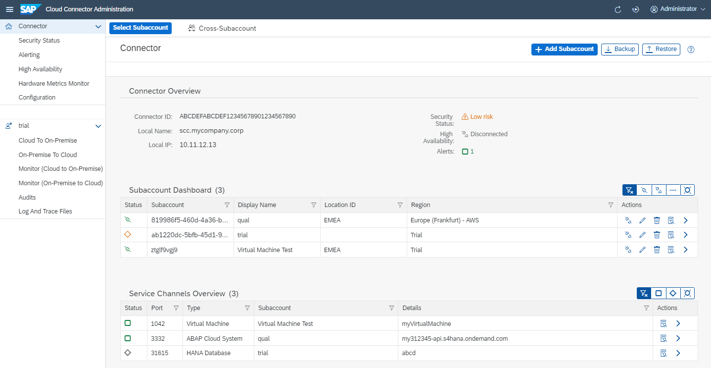

<!-- loio449dbf5fd2294f93aafb996a231b3155 -->

# Service Channels: Port Overview

A service channel overview lets you see the details of all service channels that are used by a Cloud Connector installation.

The service channel port overview lists all service channels that are configured in the Cloud Connector. It lets you see at a glance, which server ports are used by a Cloud Connector installation.

In addition, you can find the following information about each service channel:

-   Status \(***enabled***, ***disabled***, ***disconnected***\)
-   Service channel type \(***ABAP Cloud System***, ***Kubernetes Cluster***\)
-   Assigned subaccount \(display name\)
-   Details \(for example, the assigned ABAP Cloud tenant host\)

From the *Actions* column, you can switch directly to the *On-Premise To Cloud* section of the corresponding subaccount and edit the selected service channel.

To find the overview list, choose *Connector* from the navigation menu and go to section *Service Channels Overview*:

The *filter buttons* above the overview table let you filter the shown service channels based on their status. You can select all service channels, all enabled ones, all disabled ones, or all service channels for which enabling has failed.

