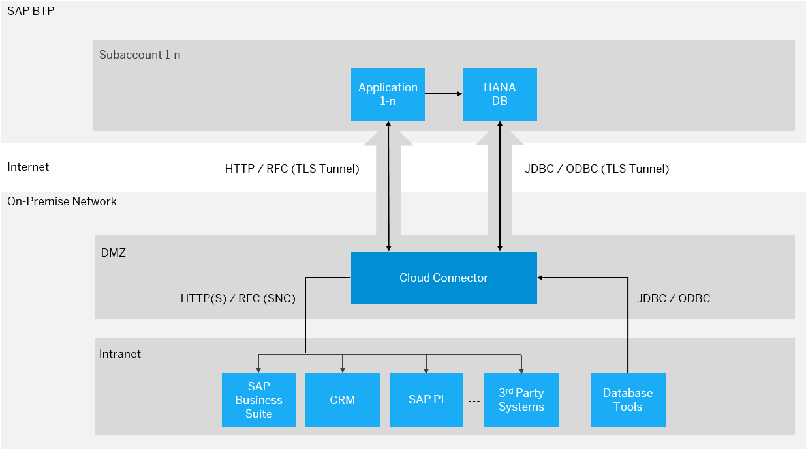

<!-- loio3ce0cbbea17a4b569a722e9a391ef590 -->

# Service Layer

You can use SAP BTP Connectivity to securely integrate cloud applications with systems running in isolated customer networks.

<a name="loio3ce0cbbea17a4b569a722e9a391ef590__section_b5l_bvs_3gb"/>

## Overview

After installing the Cloud Connector as integration agent in your on-premise network, you can use it to establish a persistent TLS tunnel to SAP BTP subaccounts.

To establish this tunnel, the Cloud Connector administrator must authenticate himself or herself against the related SAP BTP subaccount of which he or she must be a member. Once estabilshed, the tunnel can be used by applications of the connected subaccount to remotely call systems in your network.

<a name="loio3ce0cbbea17a4b569a722e9a391ef590__section_csx_rf2_l1b"/>

## Architecture

The figure below shows a system landscape in which the Cloud Connector is used for secure connectivity between SAP BTP applications and on-premise systems.

-   A single Cloud Connector instance can connect to multiple SAP BTP subaccounts, each connection requiring separate authentication and defining an own set of configuration.
-   You can connect an arbitrary number of SAP and non-SAP systems to a single Cloud Connector instance.
-   The on-premise system does not need to be touched when used with the Cloud Connector, unless you configure trust between the Cloud Connector and your on-premise system. A trust configuration is required, for example, for principal propagation \(single sign-on\), see [Configuring Principal Propagation](configuring-principal-propagation-c84d4d0.md).
-   You can operate the Cloud Connector in a high availability mode. To achieve this, you must install a second \(redundant\) Cloud Connector \(shadow instance\), which takes over from the master instance in case of a downtime.
-   The Cloud Connector also supports the communication direction from the on-premise network to the SAP BTP subaccount, using a database tunnel that lets you connect common ODBC/JDBC database tools to SAP HANA as well as other available databases in SAP BTP.

.

**Related Information**  

[Network Zones](network-zones-88efb23.md "Choosing a network zone for the Cloud Connector installation.")

[Inbound Connectivity](inbound-connectivity-90932cf.md "For inbound connections into the on-premise network, the Cloud Connector acts as a reverse invoke proxy between SAP BTP and the internal systems.")

[Outbound Connectivity](outbound-connectivity-a2ca4e8.md "The Cloud Connector supports the communication direction from the on-premise network to SAP BTP, using a database tunnel.")

[Audit Log](audit-log-d2425bd.md "As audit logging is a critical element of an organization’s risk management strategy, the Cloud Connector provides audit logging for the complete record of access between cloud and Cloud Connector as well as of configuration changes done in the Cloud Connector.")

