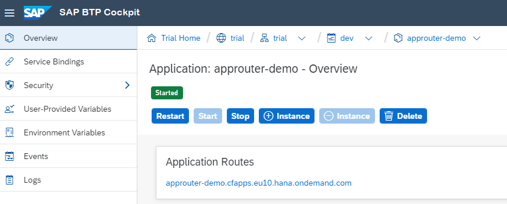

<!-- loiob14eeb94be944c62a5880bde50c59aef -->

# Set Up an Application Router

For authentication purposes, configure and deploy an application router for your test application.

> ### Note:  
> AppRouter is only required if you want to use multitenancy or perform user-specific service calls. In all other cases, JCo uses [cloud-security-xsuaa-integration](https://github.com/SAP/cloud-security-xsuaa-integration/tree/master/token-client) with `ClientCredentialFlow`.

1.  To set up an application router, follow the steps in [Application Router](https://help.sap.com/viewer/65de2977205c403bbc107264b8eccf4b/Cloud/en-US/01c5f9ba7d6847aaaf069d153b981b51.html "The application router is the single point-of-entry for an application running in the Cloud Foundry environment on SAP BTP. The application router is used to serve static content, authenticate users, rewrite URLs, and forward or proxy requests to other micro services while propagating user information.") :arrow_upper_right: or use the demo file *approuter.zip* \([download](https://help.sap.com/http.svc/download?deliverable_id=21564649)\).
2.  For deployment, you need a manifest file, similar to this one:

    > ### Sample Code:  
    > ```
    > 
    > ---
    > 
    > applications:
    > 
    >  
    > 
    > - name: approuter-jco-demo-p1234
    > 
    >   path: ./
    > 
    >   buildpacks:
    > 
    >   - nodejs_buildpack
    > 
    >   memory: 120M
    > 
    >   routes:
    > 
    >   - route: approuter-jco-demo-p1234.cfapps.eu10.hana.ondemand.com
    > 
    >   env:
    > 
    >     NODE_TLS_REJECT_UNAUTHORIZED: 0
    > 
    >     destinations: >
    > 
    >       [
    > 
    >          {"name":"dest-to-example", "url" :"https://jco-demo-p1234.cfapps.eu10.hana.ondemand.com/ConnectivityRFCExample", "forwardAuthToken": true }
    > 
    >       ]
    > 
    >   services:
    > 
    >     - xsuaa_jco
    > 
    > ```

    > ### Note:  
    > -   The routes and destination URLs need to fit your test application.
    > -   In this example, we already bound our XSUAA instance to the application router. Alternatively, you could also do this via the cloud cockpit.

3.  Push the approuter with `cf push -f manifest.yml -p approuter.zip`.
4.  To navigate to the `approuter` application in the cloud cockpit, choose *<your\_space\>* \> *Applications* \> *<your application\>* \> *Overview*.

    

5.  When choosing the application route, you are requested to login. Provide the credentials known by the IdP you configured in *Roles & Trust*.
6.  After successful login, you are routed to the test application which is then executed.
7.  If the application issues an exception, saying that the `JCoDemoSystem` destination has not yet been specified, you must configure the `JCoDemoSystem` destination first.

    ```
    
    Exception occurred while executing STFC_CONNECTION in system JCoDemoSystem 
    
    com.sap.conn.jco.JCoException: (106) JCO_ERROR_RESOURCE: Destination JCoDemoSystem does not exist
        at com.sap.conn.jco.rt.DefaultDestinationManager.update(DefaultDestinationManager.java:223)
        at com.sap.conn.jco.rt.DefaultDestinationManager.searchDestination(DefaultDestinationManager.java:377)
        at com.sap.conn.jco.rt.DefaultDestinationManager.getDestinationInstance(DefaultDestinationManager.java:96)
        at com.sap.conn.jco.JCoDestinationManager.getDestination(JCoDestinationManager.java:52)
        at com.sap.demo.jco.ConnectivityRFCExample.doGet(ConnectivityRFCExample.java:47)
    
            ..... (cut rest of the call stack)
    
    ```

    > ### Note:  
    > Make sure you **don't** include this dependency
    > 
    > ```
    > <dependency>
    > 	<groupId>com.sap.cloud.security</groupId>
    > 	<artifactId>java-security</artifactId>
    > </dependency>
    > ```
    > 
    > or any of its dependencies such as `java-api` with scope `compile` directly or transitively with any other jar.


<a name="loiob14eeb94be944c62a5880bde50c59aef__section_psq_mkr_cnb"/>

## Calling JCo APIs from Newly Created Threads

If you are using an Application Router and it is mandatory for you to call JCo APIs from a different thread than the one which is executing your servlet function, make sure the thread local information of the [cloud-security-xsuaa-integration API](https://github.com/SAP/cloud-security-xsuaa-integration), used by JCo internally, is set again within your newly created thread.

To do this, add the following dependency to your project:

```
<dependency>
    <groupId>com.sap.cloud.security</groupId>
    <artifactId>java-api</artifactId>
    <version>2.7.7</version>
    <scope>provided</scope>
</dependency>

```

Adjust your code from the step [Develop a Sample Web Application](develop-a-sample-web-application-7808d1d.md) in the following way:

> ### Sample Code:  
> ```
> package com.sap.demo.jco;
> 
> import java.io.IOException;
> import java.io.PrintWriter;
> 
> import javax.servlet.ServletException;
> import javax.servlet.annotation.WebServlet;
> import javax.servlet.http.HttpServlet;
> import javax.servlet.http.HttpServletRequest;
> import javax.servlet.http.HttpServletResponse;
> 
> import com.sap.cloud.security.token.SecurityContext;
> import com.sap.cloud.security.token.Token;
> import com.sap.conn.jco.AbapException;
> import com.sap.conn.jco.JCoDestination;
> import com.sap.conn.jco.JCoDestinationManager;
> import com.sap.conn.jco.JCoException;
> import com.sap.conn.jco.JCoFunction;
> import com.sap.conn.jco.JCoParameterList;
> import com.sap.conn.jco.JCoRepository;
> 
> /**
>  * 
>  * Sample application that uses the connectivity service. In particular, it is
>  * making use of the capability to invoke a function module in an ABAP system
>  * via RFC
>  * 
>  * Note: The JCo APIs are available under <code>com.sap.conn.jco</code>.
>  */
> 
> @WebServlet("/ConnectivityRFCExample/*")
> public class ConnectivityRFCExample extends HttpServlet {
> 	private static final long serialVersionUID = 1L;
> 
> 	protected void doGet(HttpServletRequest request, HttpServletResponse response)
> 			throws ServletException, IOException {
> 		PrintWriter responseWriter = response.getWriter();
> 
> 		// access the token from the thread which is executing the servlet
> 		Token token = SecurityContext.getToken();
> 
> 		Thread runThread = new Thread(() -> {
> 			// set the information in the newly created thread
> 			SecurityContext.setToken(token);
> 
> 			try {
> 				// access the RFC Destination "JCoDemoSystem"
> 				JCoDestination destination = JCoDestinationManager.getDestination("JCoDemoSystem_Normal");
> 
> 				// make an invocation of STFC_CONNECTION in the backend
> 				JCoRepository repo = destination.getRepository();
> 				JCoFunction stfcConnection = repo.getFunction("STFC_CONNECTION");
> 
> 				JCoParameterList imports = stfcConnection.getImportParameterList();
> 				imports.setValue("REQUTEXT", "SAP BTP Connectivity runs with JCo");
> 				stfcConnection.execute(destination);
> 
> 				JCoParameterList exports = stfcConnection.getExportParameterList();
> 				String echotext = exports.getString("ECHOTEXT");
> 				String resptext = exports.getString("RESPTEXT");
> 
> 				response.addHeader("Content-type", "text/html");
> 				responseWriter.println("<html><body>");
> 				responseWriter.println("<h1>Executed STFC_CONNECTION in system JCoDemoSystem</h1>");
> 				responseWriter.println("<p>Export parameter ECHOTEXT of STFC_CONNECTION:<br>");
> 				responseWriter.println(echotext);
> 				responseWriter.println("<p>Export parameter RESPTEXT of STFC_CONNECTION:<br>");
> 				responseWriter.println(resptext);
> 				responseWriter.println("</body></html>");
> 			} catch (AbapException ae) {
> 				// just for completeness: As this function module does not have an exception
> 				// in its signature, this exception cannot occur. But you should always
> 				// take care of AbapExceptions
> 			} catch (JCoException e) {
> 				response.addHeader("Content-type", "text/html");
> 				responseWriter.println("<html><body>");
> 				responseWriter
> 						.println("<h1>Exception occurred while executing STFC_CONNECTION in system JCoDemoSystem</h1>");
> 				responseWriter.println("<pre>");
> 				e.printStackTrace(responseWriter);
> 				responseWriter.println("</pre>");
> 				responseWriter.println("</body></html>");
> 			} finally {
> 				// after execution clear the token again
> 				SecurityContext.clearToken();
> 			}
> 		});
> 
> 		runThread.start();
> 
> 		// wait to be finished
> 		try {
> 			runThread.join();
> 		} catch (InterruptedException e) {
> 			e.printStackTrace(responseWriter);
> 		}
> 	}
> }
> 
> ```

> ### Note:  
> If you want to use [thread pools](https://docs.oracle.com/javase/tutorial/essential/concurrency/pools.html), make sure that in your thread pool implementation this information is set correctly in the thread which is about to be \(re\)used, and removed as soon as the thread is put back into the pool.


<a name="loiob14eeb94be944c62a5880bde50c59aef__section_xsy_nkc_cgb"/>

## Next Steps

-   [Configure the RFC Destination](configure-the-rfc-destination-296f457.md)
-   [Configure the Cloud Connector](configure-the-cloud-connector-783a96e.md)
-   [Monitoring Your Web Application](monitoring-your-web-application-e2ce724.md) \(Optional\)

