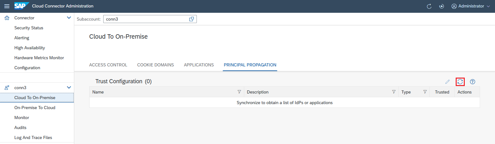

<!-- loioa4ee70f0274248f8bbc7594179ef948d -->

# Set Up Trust

Establish trust to an identiy provider to support principal propagation and technical user propagation.

<a name="loioa4ee70f0274248f8bbc7594179ef948d__tasks"/>

## Tasks

[Configure Trusted Entities in the Cloud Connector](set-up-trust-a4ee70f.md#loioa4ee70f0274248f8bbc7594179ef948d__configure_trust)

[Configure an On-Premise System for Principal Propagation](set-up-trust-a4ee70f.md#loioa4ee70f0274248f8bbc7594179ef948d__configure_on_premise)

[Trust Cloud Applications in the Cloud Connector](set-up-trust-a4ee70f.md#loioa4ee70f0274248f8bbc7594179ef948d__trust_cloud_apps)

[Set up a Trust Store](set-up-trust-a4ee70f.md#loioa4ee70f0274248f8bbc7594179ef948d__TrustStore)

<a name="loioa4ee70f0274248f8bbc7594179ef948d__configure_trust"/>

## Configure Trusted Entities in the Cloud Connector

> ### Note:  
> The information in this section applies to both principal propagation and technical user propagation.

You perform trust configuration to support principal propagation, that is, forwarding the *logged-on identity* in the cloud to the internal system without the need of providing the password. The same is done for technical user propagation, which logs on a *technical* user identified by an access token for an OAuth client without the need of providing the password.

By default, your Cloud Connector does not trust any entity that issues tokens for principal propagation. Therefore, the list of trusted identity providers \(IdPs\) is empty by default.

If you decide to use the principal propagation feature, you must establish trust to at least one IdP. The following IdP types are supported:

-   **Neo** environment: *SAML* IdPs.

    > ### Note:  
    > In the Neo environment, you can also trust *HANA instances* and *Java applications* to act as IdPs.

-   **Cloud Foundry** environment: *OAuth* IdPs.

You can configure trust to one or more IdPs per subaccount. After you've configured trust in the cockpit for your subaccount, for example, to your own company's IdP\(s\), you can synchronize this list with your Cloud Connector.

From your subaccount menu, choose *Cloud to On-Premise* and go to the *Principal Propagation* tab. Choose the *Synchronize* button to store the list of existing identity providers locally in your Cloud Connector.

Select an entry to see its details:

-   `Name`: the name associated with the identity provider.
-   `Description`: descriptive information about this entry.
-   `Type`: type of the trusted entity.
-   `Trusted`: indicates whether the entry is trusted for principal propagation.
-   `Actions`: Choose the *Show Certificate Information* icon to display detail information for the corresponding entry. The Cloud Connector runtime will use the certificate associated with the entry to verify that the assertion used for principal propagation was issued by a trusted entity.

You can decide for each entry, whether to trust it for the principal propagation use case by choosing *Edit* and \(de\)selecting the *Trusted* checkbox.

> ### Note:  
> Whenever you update a SAML IdP configuration for a subaccount on cloud side, you must synchronize the trusted entities in theCloud Connector. Otherwise the validation of the forwarded SAML assertion will fail with an exception containing an exception message similar to this: *Caused by: com.sap.engine.lib.xml.signature.SignatureException: Unable to validate signature -\> java.security.SignatureException: Signature decryption error: javax.crypto.BadPaddingException: Invalid PKCS\#1 padding: encrypted message and modulus lengths do not match!*.

For more information, see also [Include Tokens from Corporate Identity Providers or Identity Authentication in Tokens of the SAP Authorization and Trust Management Service](https://help.sap.com/docs/btp/sap-business-technology-platform/including-tokens-from-corporate-identity-providers-or-identity-authentication-in-tokens-of-sap-authorization-and-trust-management-service).

Back to [Tasks](set-up-trust-a4ee70f.md#loioa4ee70f0274248f8bbc7594179ef948d__tasks)

<a name="loioa4ee70f0274248f8bbc7594179ef948d__configure_on_premise"/>

## Configure an On-Premise System for Principal Propagation

Set up principal propagation from SAP BTP to your internal system that is used in a hybrid scenario.

> ### Note:  
> As a prerequisite for principal propagation for RFC, the following cloud application runtime versions are required:
> 
> -   for Java Web: `1.51.8` or higher
> -   for Java EE 6 Web Profile: `2.31.11` or higher
> -   other runtimes support it with any version

1.  Set up trust to an entity that is issuing an assertion for the logged-on user \(see section above\).
2.  Set up the system identity for the Cloud Connector.
    -   For HTTPS, you must import a system certificate into your Cloud Connector.
    -   For RFC, you must import an SNC PSE into your Cloud Connector.

3.  Configure the target system to trust the Cloud Connector.

    There are two levels of trust:

    1.  First, you must allow the Cloud Connector to identify itself with its system certificate \(for HTTPS\), or with the SNC PSE \(for RFC\).
    2.  Then, you must allow this identity to propagate the user accordingly:
        -   For HTTPS, the Cloud Connector forwards the true identity in a short-lived `X.509` certificate in an HTTP header named `SSL_CLIENT_CERT`. The system must use this certificate for logging on the real user. The SSL handshake, however, is performed through the system certificate. For more information on identity forwarding, see [Configure Access Control \(HTTP\)](configure-access-control-http-e7d4927.md).
        -   For RFC, the Cloud Connector forwards the true identity as part of the RFC protocol.

    For more information, see [Configuring Identity Propagation to an ABAP System](configuring-identity-propagation-to-an-abap-system-6705cc3.md).

4.  Configure the user mapping in the target system. The `X.509` certificate contains information about the cloud user in its subject. Use this information to map the identity to the appropriate user in this system. This step applies for both HTTPS and RFC.

> ### Note:  
> If you have the following scenario: *Application1-\>AppToAppSS0-\>Application2-\>Principal Propagation-\>On premise Backend System* you must mark *Application2* as `trusted` by the Cloud Connector in tab *Principal Propagation*, section *Trust Configuration*.
> 
> If you use an identity provider that issues unsigned assertions, you must mark all relevant applications as `trusted` by the Cloud Connector in tab *Principal Propagation*, section *Trust Configuration*.

Back to [Tasks](set-up-trust-a4ee70f.md#loioa4ee70f0274248f8bbc7594179ef948d__tasks)

<a name="loioa4ee70f0274248f8bbc7594179ef948d__trust_cloud_apps"/>

## Trust Cloud Applications in the Cloud Connector

Configure an allowlist for trusted cloud applications, see [Configure Trust](configure-trust-13bfb28.md).

Back to [Tasks](set-up-trust-a4ee70f.md#loioa4ee70f0274248f8bbc7594179ef948d__tasks)

<a name="loioa4ee70f0274248f8bbc7594179ef948d__TrustStore"/>

## Set up a Trust Store

Configure a trust store that acts as an allowlist for trusted on-premise systems. See [Configure Trust](configure-trust-13bfb28.md).

Back to [Tasks](set-up-trust-a4ee70f.md#loioa4ee70f0274248f8bbc7594179ef948d__tasks)

<a name="loioa4ee70f0274248f8bbc7594179ef948d__section_bmf_sz3_4hb"/>

## Related Information

[Principal Propagation](principal-propagation-e2cbb48.md)\(Cloud Foundry\)

[Principal Propagation](https://help.sap.com/viewer/b865ed651e414196b39f8922db2122c7/Cloud/en-US/d4d3e1e9b2dd44318b49a4812cd51383.html "Forward the identity of cloud users to an on-premise system to enable single sign-on (Neo environment).") :arrow_upper_right: \(Neo\)

