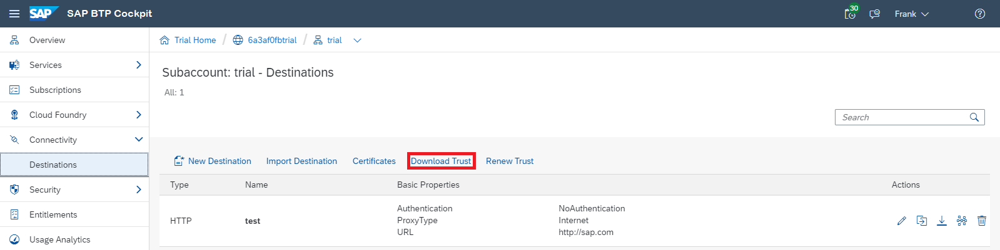
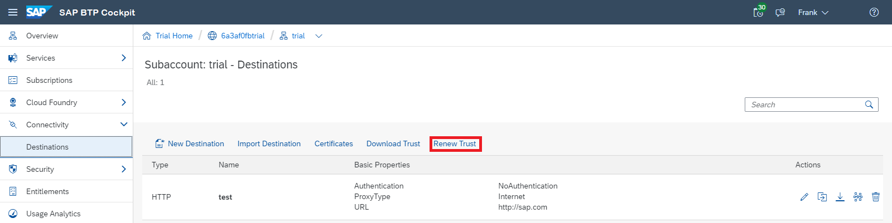

<!-- loio82dbecae3454493782d16a79e30f1a6d -->

# Set up Trust Between Systems

Download and configure X.509 certificates as a prerequisite for user propagation from the Cloud Foundry environment.

Setting up a trust scenario for user propagation requires the exchange of public keys and certificates between the affected systems, as well as the respective trust configuration within these systems. This enables you to use an HTTP destination with authentication type `OAuth2SAMLBearerAssertion` for the communication.

A trust scenario can include user propagation from the Cloud Foundry environment to another SAP BTP environment, to another Cloud Foundry subaccount, or to a remote system outside SAP BTP, like S/4HANA Cloud, C4C, Success Factors, and others.

<a name="loio82dbecae3454493782d16a79e30f1a6d__setup_cert"/>

## Set Up a Certificate

Download and save locally the identifying X509 certificate of the subaccount in the Cloud Foundry environment.

1.  In the cloud cockpit, log on with `Administrator` permission.
2.  Navigate to your subaccount in the Cloud Foundry environment.
3.  From the left-side menu, choose *Connectivity* \> *Destinations* .
4.  Choose the *Download Trust* button and save locally the X.509 certificate that identifies this subaccount.

    

5.  Configure the downloaded X.509 certificate in the target system to which you want to propagate the user.

<a name="loio82dbecae3454493782d16a79e30f1a6d__renew_cert"/>

## Renew a Certificate

If the X.509 certificate validity is about to expire, you can renew the certificate and extend its validity by another 2 years.

1.  In the cloud cockpit, log on with `Administrator` permission.
2.  Navigate to your subaccount in the Cloud Foundry environment.
3.  From the left-side menu, choose *Connectivity* \> *Destinations* .
4.  Choose the *Renew Trust* button to trigger a renewal of the existing X509 certificate.

    

5.  Choose the *Download Trust* button and save locally the X.509 certificate that identifies this subaccount.
6.  Configure the renewed X.509 certificate in the target system to which you want to propagate the user.

<a name="loio82dbecae3454493782d16a79e30f1a6d__section_vx1_jct_xvb"/>

## Rotate Certificates

You can rotate the identifying X.509 certificate of the subaccount. Rotation is done by creating a passive X.509 certificate for the subaccount, configuring it in the target system to which you want to propagate the user, and rotating it with the active one. After rotation is performed, the active X.509 certificate becomes passive and the passive one active.

> ### Note:  
> The passive X.509 certificate and the certificate rotation can be managed only via the Destination service REST API. For more information, see [Destination Service REST API](destination-service-rest-api-23ccafb.md).

**Procedure**

1.  Generate or renew the passive X.509 certificate: `POST /saml2Metadata/certificate/passive`.
2.  Download and save locally the passive X.509 certificate: `GET /saml2Metadata/certificate/passive`.
3.  Configure the downloaded X.509 passive certificate in the target system you want to propagate the user to.
4.  Rotate the active certificate, making the active one passive and the passive one active: `POST /saml2Metadata/rotateCertificate`.
5.  Check that user propagation is working correctly. If it is not, you can rotate the certificates again until fixing the issue.
6.  \(Optional\): Delete the passive X.509 certificate, which used to be active before rotation: `DELETE /saml2Metadata/certificate/passive`.
7.  \(Optional\): Delete the passive X.509 certificate, which used to be active before rotation, from the target system.

**Related Information**  

[Principal Propagation from the Cloud Foundry to the Neo Environment](https://help.sap.com/viewer/65de2977205c403bbc107264b8eccf4b/Cloud/en-US/391e9ed92ff448e0b4bacac69f853516.html#loio391e9ed92ff448e0b4bacac69f853516 "Enable an application in your subaccount in the Cloud Foundry environment to access an OAuth-protected application in a subaccount in the Neo environment without user login (and user interaction) in the second application. For this scenario to work, the two subaccounts need to be in mutual trust, and in trust with the same identity provider. The first application will propagate its logged-in user to the second application using an OAuth2SAMLBearer destination.") :arrow_upper_right:

[User Propagation from the Cloud Foundry Environment to SAP S/4HANA Cloud](user-propagation-from-the-cloud-foundry-environment-to-sap-s-4hana-cloud-9af03a0.md "Configure user propagation (single sign-on), using OAuth communication from the SAP BTP Cloud Foundry environment to S/4HANA Cloud. As OAuth mechanism, you use the OAuth 2.0 SAML Bearer Assertion Flow.")

[User Propagation from the Cloud Foundry Environment to SAP SuccessFactors](user-propagation-from-the-cloud-foundry-environment-to-sap-successfactors-67a3b83.md "Configure user propagation from the SAP BTP Cloud Foundry environment to SAP SuccessFactors.")

[SAP BTP Destination Service Expiring Certificate Notification](https://help.sap.com/viewer/5967a369d4b74f7a9c2b91f5df8e6ab6/Cloud/en-US/92e3840b38824ea28f8c9be692ca5f83.html "This event is triggered for expiring certificates with no automatic renewal. It is triggered few times for each expiring certificate - 14 days before certificate expiration, 7 days before certificate expiration and 3 days before certificate expiration.") :arrow_upper_right:

