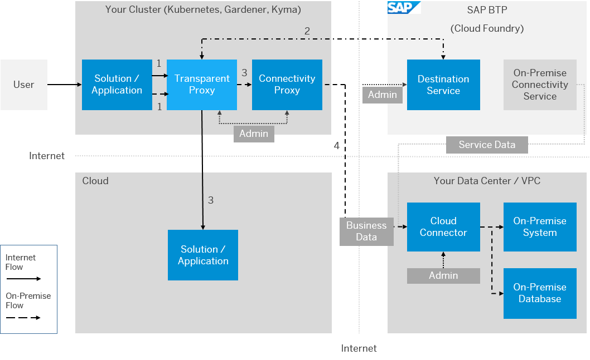

<!-- loioacc64ada71e34f98867f16fbcc471b5e -->

# Transparent Proxy for Kubernetes

Use the transparent proxy for Kubernetes to connect workloads on a Kubernetes cluster to Internet and on-premise applications.

The transparent proxy routes to SAP BTP destinations configured in the Destination service. On-premise applications must be exposed via [Cloud Connector](cloud-connector-e6c7616.md) \(installed in the same network right next to the on-premise system\) and [Connectivity Proxy for Kubernetes](connectivity-proxy-for-kubernetes-e661713.md) \(installed in the Kubernetes cluster\).

The transparent proxy is delivered as Docker images and a Helm chart. You need to run the image on your Kubernetes cluster with appropriate configurations. The Helm chart simplifies the installation process.

The transparent proxy handles HTTP\(s\) protocol for Internet and HTTP/TCP protocols for on-premise destinations by creating a Kubernetes service for each destination configuration. When an application tries to reach a desired system defined as a destination configuration, the transparent proxy intercepts the traffic \(1\), calls the Destination service to obtain the configuration for the requested destination \(2\), enriches the request by providing the SOCKS5 handshake for TCP and the authentication mechanism for HTTP, and routes the traffic to the desired remote system:

-   Directly for Internet-accessible solutions/applications/systems \(3\)
-   Via the connectivity proxy \(3\) and the Cloud Connector \(4\) for on-premise systems

**Related Information**  

[Using the Transparent Proxy](using-the-transparent-proxy-c5257cf.md "Use the transparent proxy for Kubernetes in different SAP BTP communication scenarios.")

[Multitenancy](multitenancy-6478985.md "Use multitenancy for the transparent proxy for Kubernetes.")

[Destination Custom Resource Scope](destination-custom-resource-scope-bd47cbe.md "Define the access control scope of the destination custom resources for the transparent proxy for Kubernetes.")

[Integration with SAP BTP Connectivity](integration-with-sap-btp-connectivity-aa9fc26.md "Integrate the transparent proxy with other SAP BTP Connectivity services.")

[Lifecycle Management](lifecycle-management-1c18e0c.md "Use the Helm chart to configure and manage the lifecycle of the transparent proxy.")

[Monitoring](monitoring-ba6f417.md "Check the availability, status, and destination custom resources of the transparent proxy for Kubernetes.")

[Troubleshooting](troubleshooting-fce292a.md "Find troubleshooting information for the transparent proxy for Kubernetes.")

[Recommended Actions](recommended-actions-20b1a62.md "To resolve issues with the transparent proxy for Kubernetes, follow the recommendations below.")

[Resilience](resilience-43b90bc.md "Improve resilience of the transparent proxy for Kubernetes.")

[Verification and Testing](verification-and-testing-86dde3e.md "Check the transparent proxy for Kubernetes after installation.")

[Transparent Proxy in the Kyma Environment](transparent-proxy-in-the-kyma-environment-1700cfe.md "Use the transparent proxy in the Kyma environment.")

[Dynamic Lookup of Destinations](dynamic-lookup-of-destinations-6836e00.md "Create a single custom resource to look up one ore more destinations dynamically with the transparent proxy for Kubernetes.")

