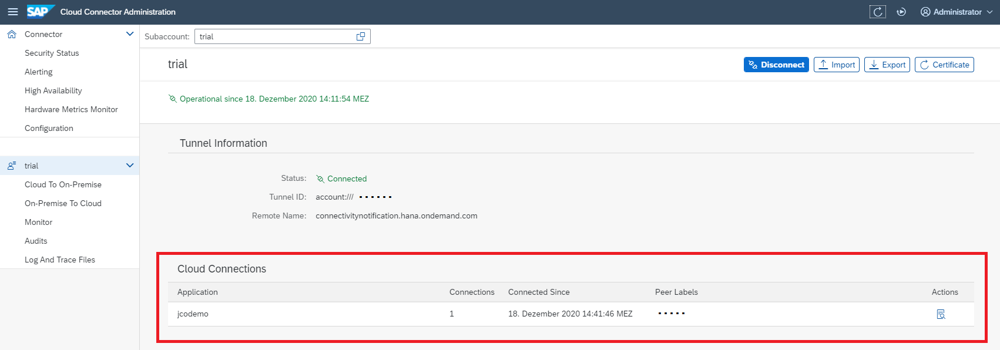
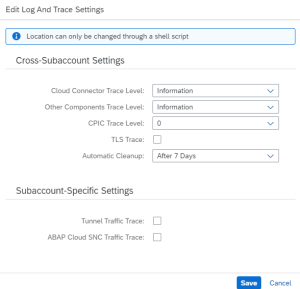
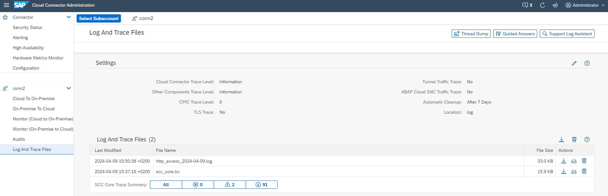
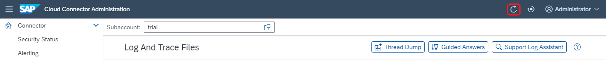

<!-- loioe7df7f15bb571014ae24bca245319880 -->

# Troubleshooting

To troubleshoot connection problems, monitor the state of your open tunnel connections in the Cloud Connector, and view different types of logs and traces.

> ### Note:  
> For information about a specific problem or an error you have encountered, see [Connectivity Support](connectivity-support-e5580c5.md).

<a name="loioe7df7f15bb571014ae24bca245319880__section_E39F4F24008144EE82A5AF143487BBA4"/>

## Monitoring

To view a list of all currently connected applications, choose your *Subaccount* from the left menu and go to section *Cloud Connections*:

The provided information includes:

-   *Application name*: The name of the application, as also shown in the cockpit, for your subaccount
-   *Connections*: The number of currently existing connections to the application
-   *Connected Since*: The earliest start time of a connection to this application
-   *Peer Labels*: The name of the application processes, as also shown for this application in the cockpit, for your subaccount

<a name="loioe7df7f15bb571014ae24bca245319880__section_Logs"/>

## Log and Trace Settings

The *Log and Trace Files* page includes some files for troubleshooting that are intended primarily for SAP Support. These files include information about both internal Cloud Connector operations and details about the communication between the local and the remote \(SAP BTP\) tunnel endpoint.

If you encounter problems that seem to be caused by some trouble in the communication between your cloud application and the on-premise system, choose *Log and Trace Files* from your *Subaccount* menu, go to section *Settings*, and activate the respective traces by selecting the *Edit* button:

-   *Cloud Connector Trace Level* adjusts the levels for Java loggers directly related to Cloud Connector functionality.
-   *Other Components Trace Level* adjusts the log level for all other Java loggers available at the runtime. Change this level only when requested to do so by SAP support. When set to a level higher than `Information`, it generates a large number of trace entries.
-   *CPIC Trace Level* allows you to set the level between 0 and 3 and provides traces for the CPIC-based RFC communication with ABAP systems.
-   When the *Tunnel Traffic Trace* is activated for a subaccount, all the HTTP and RFC traffic crossing the tunnel for that subaccount going through this Cloud Connector, is traced in files with names `tunnel_traffic_<account id>_on_<landscapehost>.trc`. This is helpful if you need to understand what documents have been exchanged between the involved systems.
-   **ABAP Cloud SNC Traffic Trace**: When the *ABAP Cloud SNC traffic trace* is activated for an account, all RFC SNC-based traffic crossing a service channel for that account \(going through this Cloud Connector\), is traced in files with names *snc\_traffic\_<account id\>\_on\_<landscapehost\>.trc*. This is helpful if you need to understand issues with SNC termination in the Cloud Connector.
-   *SSL Trace*: When the SSL trace is activated, the `scc_core.trc` file includes information for SSL-protected communication. To activate a change of this setting, a restart is required. Activate this trace only when requested by SAP support. It has a high impact on performance as it produces a large amount of traces.

-   *Automatic Cleanup* lets you remove old trace files that have not been changed for a period of time exceeding the configured interval. You can choose from a list of predefined periods. The default is `Never`.

> ### Caution:  
> Use any **traffic and CPIC tracing at level 3** carefully, and only when requested to do so for support reasons. These traces may write sensitive information \(such as payload data of HTTP/RFC requests and responses\) to the trace files, and thus present a potential security risk. The Cloud Connector supports the implementation of a "four-eyes principle" for activating the trace levels that dump the network traffic into a trace file. This principle requires two users to activate a trace level that records traffic data.
> 
> For more information, see [Secure the Activation of Traffic Traces](secure-the-activation-of-traffic-traces-4c8f678.md).

## Change the Location of Trace Files

As of Cloud Connector 2.14 you can move trace files to a different location.

> ### Note:  
> JVM-related files will remain in the standard location `log`.

> ### Note:  
> Make sure there is enough space left on the device for the desired location and the Cloud Connector OS user has permission to write files to that location.

If you want to do this, proceed as follows:

1.  Shut down the Cloud Connector.
2.  Execute the respective script for the location change.
    1.  For Microsoft Windows OS: `changeLogAndTracePath.bat <desiredLocation>`.
    2.  For Linux OS and Mac OS X: `./changeLogAndTracePath.sh <desiredLocation>`.

3.  The script checks if the target might be a network location. If this is assumed, the script asks for confirmation. Afterwards, it tries to move the existing current trace file to the new location. Only after successful move, the location change takes effect. Otherwise, the file remains in the old place.
4.  Start the Cloud Connector again.

> ### Caution:  
> If you choose a network location while access to the file system is slow, overall processing performance of the Cloud Connector may decrease significantly.

## Log and Trace Files

View all existing trace files and delete the ones that are no longer needed.

To prevent your browser from being overloaded when multiple large files are loaded simultaneously, the Cloud Connector loads only one page into memory. Use the page buttons to move through the pages.

Use the *Download*/*Download All* icons to create a ZIP archive containing one trace file or all trace files. Download it to your local file system for convenient analysis.

> ### Note:  
> If you want to download more than one file, but not all, select the respective rows of the table and choose *Download All*.

When running the Cloud Connector with SAP JVM or as of version 2.14 also with other JVMs, you can trigger the creation of a thread dump by choosing the *Thread Dump* button, which will be written to the JVM trace file *log/vm\_$PID\_trace.log* for SAP JVM and *log/vm\_$PID\_threads.log* for other JVMs. You may be asked by SAP support to create one, if considered helpful during incident analysis.

> ### Note:  
> From the UI, you can't delete trace files that are currently in use. You can delete them from the Linux OS command line; however, we recommend that you do not use this option to avoid inconsistencies in the internal trace management of the Cloud Connector.

Two buttons may be helpful to solve issues on your own:

-   *Guided Answers*: A new tab or window opens, showing the Cloud Connector section in [Guided Answers](https://ga.support.sap.com/dtp/viewer/#/tree/2065/actions/26547:26556). It helps you identify many issues that are classified through hierarchical topics. Once you found a matching issue, a solution is provided either directly, or by references to SAP Help Portal, Knowledge Base Articles \(KBAs\), and SAP notes.
-   *Support Log Assistant*: Opens the support log assistant. There, you can upload Cloud Connector log files and have them analyzed. After triggering the scan, the tool lists all issues for which a solution can be identified.

    > ### Note:  
    > The support log assistant analyzes the complete log. Therefore, also older issues may be found that are no longer relevant.

Once a problem has been identified, you should turn off the trace again by editing the trace and log settings accordingly to not flood the files with unnecessary entries.

Use the *Refresh* button to update the information that appears. For example, you can use this button because more trace files might have been written since you last updated the display.

<a name="loioe7df7f15bb571014ae24bca245319880__section_wsn_frv_2jb"/>

## Error Analysis and Support: Which Logs are Relevant?

If you contactSAP support for help, please always attach the appropriate log files and provide the timestamp or period, when the reported issue was observed. Depending on the situation, different logs may help to find the root cause.

Some typical settings to get the required data are listed below:

-   *<Cloud Connector Trace\>* provides **details related to connections to SAP BTP and to backend systems as well as master-shadow communication in case of a high availability setup**. However, it does not contain any payload data. This kind of trace is written into `scc_core.trc`, which is the most relevant log for the Cloud Connector.
-   *<Other Components Trace\>* provides **details related to the tomcat runtime**, in which the Cloud Connector is running. The traces are written into `scc_core.trc` as well, but they are needed only in very special support situations. If you don't need these traces, leave the level on `Information` or even lower.
-   **Tunnel traffic** is written into the traffic trace file for HTTP or RFC requests if the tunnel traffic trace is activated, or into the CPI-C trace file for RFC requests, if the CPI-C trace is set to level 3.
-   **ABAP Cloud SNC traffic** is written into a ABAP Cloud SNC traffic file for incoming SNC RFC requests if ABAP Cloud SNC traffic trace is activated.
-   *<TLS trace\>* is helpful to **analyze TLS handshake failures** from Cloud Connector to Cloud or from Cloud Connector to backend. It should be turned off again as soon as the issue has been reproduced and recorded in the traces.
-   Setting the audit log on level `ALL` for *<Subaccount Audit Level\>* is the easiest way to **check if a request reached the the Cloud Connector and if it is being processed**.

**Related Information**  

[Getting Support](https://help.sap.com/viewer/65de2977205c403bbc107264b8eccf4b/Cloud/en-US/5dd739823b824b539eee47b7860a00be.html "To get assistance, use the available support channels provided by SAP for Me.") :arrow_upper_right:

