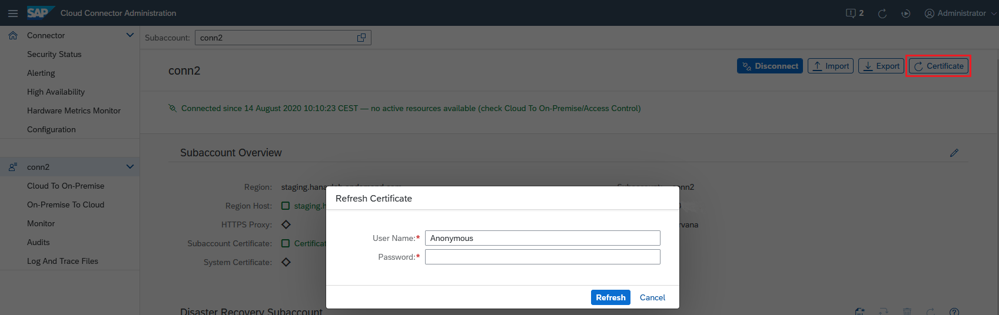

<!-- loio071708a655de4486b498cf5b16fb8ea8 -->

# Update the Certificate for a Subaccount

Certificates used by the Cloud Connector are issued with a limited validity period. To prevent a downtime while refreshing the certificate, you can update it for your subaccount directly from the administration UI.

<a name="loio071708a655de4486b498cf5b16fb8ea8__section_f1x_j5y_vmb"/>

## Prerequisites

You must have the required subaccount authorizations on SAP BTP to update certificates for your subaccount.

See:

-   [Connectivity: Technical Roles](what-is-sap-btp-connectivity-daca64d.md#loiodaca64dacc6148fcb5c70ed86082ef91__technical) \(**Cloud Foundry** environment\)

<a name="loio071708a655de4486b498cf5b16fb8ea8__section_lrc_k5y_vmb"/>

## Procedure

> ### Tip:  
> You can use this procedure even if the certificate has already expired.

Proceed as follows to update your subaccount certificate:

1.  From the main menu, choose your subaccount.

    > ### Note:  
    > To check the certificate's validity, click on the *<Subaccount Certificate\>* in section *Subaccount Overview*.

2.  Choose the *Certificate* button. A dialog opens, requesting a user name and password.
3.  Enter *<User Name\>* and *<Password\>* and choose *OK*. The certificate assigned to your subaccount is refreshed.

    > ### Note:  
    > In the **Cloud Foundry** environment, you must provide your `Login E-mail` instead of a user ID as *<User Name\>*.

    > ### Tip:  
    > When using SAP Cloud Identity Services - Identity Authentication \(IAS\) as platform identity provider with two-factor authentication \(2FA / MFA\) for your subaccount, you can simply append the required token to the regular password. For example, if your password is "eX7?6rUm" and the one-time passcode is "123456", you must enter "eX7?6rUm123456" into the *<Password\>* field.

4.  If you have configured a disaster recovery subaccount, go to section *Disaster Recovery Subaccount* below and choose *Refresh Disaster Recovery Certificate*.
5.  Enter *<User Name\>* and *<Password\>* as in step 3 and choose *OK*.

