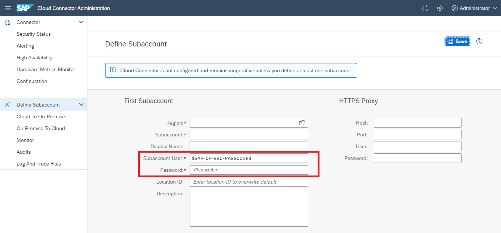
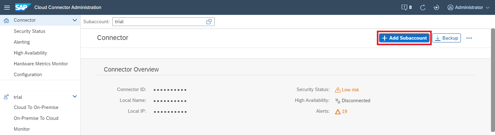
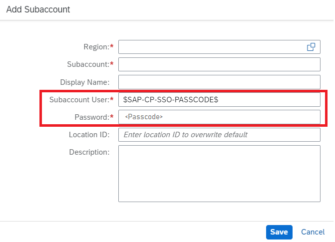
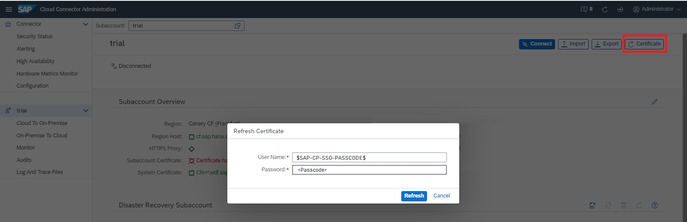

<!-- loio202261235a204db5ba0b35bbaa6d40ff -->

# Use a Custom IDP for Subaccount Configuration

Enable custom identity provider \(IDP\) authentication to configure a Cloud Foundry subaccount in the Cloud Connector by using a one-time passcode.


<a name="loio202261235a204db5ba0b35bbaa6d40ff__content"/>

## Content

[Context](use-a-custom-idp-for-subaccount-configuration-2022612.md#loio202261235a204db5ba0b35bbaa6d40ff__context)

[Get the URL \[Feature Set A\]](use-a-custom-idp-for-subaccount-configuration-2022612.md#loio202261235a204db5ba0b35bbaa6d40ff__fsa)

[Get the URL \[Feature Set B\]](use-a-custom-idp-for-subaccount-configuration-2022612.md#loio202261235a204db5ba0b35bbaa6d40ff__fsb)

[Get the One-Time Passcode](use-a-custom-idp-for-subaccount-configuration-2022612.md#loio202261235a204db5ba0b35bbaa6d40ff__pass)


<a name="loio202261235a204db5ba0b35bbaa6d40ff__context"/>

## Context

For a subaccount in the **Cloud Foundry** environment that uses a custom IDP, you can choose this IDP for authentication instead of the \(default\) SAP ID service when configuring the subaccount in the Cloud Connector.

Using custom IDP authentication, you can perform the following operations in the Cloud Connector:


<table>
<tr>
<th valign="top">

Operation

</th>
<th valign="top">

Description

</th>
</tr>
<tr>
<td valign="top">

[Set up Connection Parameters and HTTPS Proxy](initial-configuration-db9170a.md#loiodb9170a7d97610148537d5a84bf79ba2__configure_proxy)

</td>
<td valign="top">

Add an *initial* subaccount to a fresh Cloud Connector installation.

</td>
</tr>
<tr>
<td valign="top">

[Managing Subaccounts](managing-subaccounts-f16df12.md)

</td>
<td valign="top">

Add *additonal* subaccounts to an existing Cloud Connector installation.

</td>
</tr>
<tr>
<td valign="top">

[Update the Certificate for a Subaccount](update-the-certificate-for-a-subaccount-071708a.md)

</td>
<td valign="top">

Refresh a subaccount certificate's validity period.

</td>
</tr>
</table>

To enable custom IDP authentication, for each of these operations you must enter the marker value `$SAP-CP-SSO-PASSCODE$` in the *<Subaccount User\>* or *<User Name\>* field, and a one-time generated passcode \(known as *temporary authentication code*\) in the *<Password\>* field:

-   When adding the **initial subaccount** to a fresh Cloud Connector installation, enter the user name `$SAP-CP-SSO-PASSCODE$` and the passcode on the Cloud Connector's *Define Subaccount* screen \(see also [Set up Connection Parameters and HTTPS Proxy](initial-configuration-db9170a.md#loiodb9170a7d97610148537d5a84bf79ba2__configure_proxy)\):

    

-   When adding one ore more **additonal subaccount\(s\)** to an existing Cloud Connector installation, provide the user name `$SAP-CP-SSO-PASSCODE$` and the passcode via the *Connector* screen \(see also [Managing Subaccounts](managing-subaccounts-f16df12.md)\):

    

    

-   To **refresh a subaccount certificate**, enter the user name `$SAP-CP-SSO-PASSCODE$` and the passcode via the corresponding *<Subaccount\>* screen \(see also [Update the Certificate for a Subaccount](update-the-certificate-for-a-subaccount-071708a.md)\):

    


To retrieve the one-time generated passcode, you must use the correct login URL for single sign-on \(SSO\) to access your custom IDP. The procedure to get this URL depends on the SAP BTP feature set you are using.

> ### Note:  
> To choose the right procedure, you must know on which cloud management tools feature set \(A or B\) your SAP BTP account is running. For more information on feature sets, see [Cloud Management Tools — Feature Set Overview](https://help.sap.com/viewer/65de2977205c403bbc107264b8eccf4b/Cloud/en-US/caf4e4e23aef4666ad8f125af393dfb2.html "Cloud management tools represent the group of technologies designed for managing SAP BTP.") :arrow_upper_right:.

**Next Step**

[Get the URL \[Feature Set A\]](use-a-custom-idp-for-subaccount-configuration-2022612.md#loio202261235a204db5ba0b35bbaa6d40ff__fsa)

[Get the URL \[Feature Set B\]](use-a-custom-idp-for-subaccount-configuration-2022612.md#loio202261235a204db5ba0b35bbaa6d40ff__fsb)

> ### Caution:  
> Mind the respective user rights described in the prerequisites for [Initial Configuration](initial-configuration-db9170a.md#loiodb9170a7d97610148537d5a84bf79ba2__prereq) and [Managing Subaccounts](managing-subaccounts-f16df12.md). For feature set A, it is mandatory to be a subaccount *Security Administrator*, not only a global account member.

Back to [Content](use-a-custom-idp-for-subaccount-configuration-2022612.md#loio202261235a204db5ba0b35bbaa6d40ff__content)


<a name="loio202261235a204db5ba0b35bbaa6d40ff__fsa"/>

## Get the URL \[Feature Set A\]

Choose one of the following options:

**Option 1: Assemble the URL**

The URL pattern is *https://login.cf.<btp-region-host\>/passcode*.

1.  Get the SAP BTP region host, for example, *eu10.hana.ondemand.com*.
2.  Assemble the final URL to be used, in this case: *https://login.cf.eu10.hana.ondemand.com/passcode*.

**Option 2: Get the URL Using the Cloud Foundry CLI**

Use the Cloud Foundry [CLI](https://docs.cloudfoundry.org/cf-cli/) to perform the following steps:

1.  Execute the command `cf api` to navigate to the SAP BTP region.
2.  Execute `cf login --sso` to get the URL.

> ### Sample Code:  
> ```
> $ cf api api.cf.eu10.hana.ondemand.com
> Setting api endpoint to api.cf.eu10.hana.ondemand.com...
> OK
> api endpoint: https://api.cf.eu10.hana.ondemand.com
> api version: 2.156.0
> $ cf login --sso
> API endpoint: https://api.cf.eu10.hana.ondemand.com
> Temporary Authentication Code ( Get one at https://login.cf.eu10.hana.ondemand.com/passcode ):
> ```

**Next Step** 

[Get the One-Time Passcode](use-a-custom-idp-for-subaccount-configuration-2022612.md#loio202261235a204db5ba0b35bbaa6d40ff__pass)

Back to [Content](use-a-custom-idp-for-subaccount-configuration-2022612.md#loio202261235a204db5ba0b35bbaa6d40ff__content)


<a name="loio202261235a204db5ba0b35bbaa6d40ff__fsb"/>

## Get the URL \[Feature Set B\]

Choose one of the following options:

**Option 1: Assemble the URL**

The URL pattern is *https://<subdomain\>.authentication.<btp-XSUAA-host\>/passcode*.

1.  Get the SAP BTP region host, for example, *eu10.hana.ondemand.com*.
2.  Assemble the final URL to be used, in this case: *https://mysubdomain.authentication.eu10.hana.ondemand.com/passcode*.

**Option 2: Get the URL Using the Connectivity Service Instance Credentials**

1.  Choose one of these steps to obtain the URL:
    -   [Create and Bind a Connectivity Service Instance](create-and-bind-a-connectivity-service-instance-a2b88cf.md) 

    -   [Create a service key](https://docs.cloudfoundry.org/devguide/services/service-keys.html)


2.  Get the value of the `token_service_url` attribute.
3.  Append `/passcode` at the end of the obtained URL.

**Next Step** 

[Get the One-Time Passcode](use-a-custom-idp-for-subaccount-configuration-2022612.md#loio202261235a204db5ba0b35bbaa6d40ff__pass)

Back to [Content](use-a-custom-idp-for-subaccount-configuration-2022612.md#loio202261235a204db5ba0b35bbaa6d40ff__content)


<a name="loio202261235a204db5ba0b35bbaa6d40ff__pass"/>

## Get the One-Time Passcode

1.  Open the resulting URL in your browser to get the one-time passcode via SSO:
    -   If *there is* an active user session, the passcode is generated automatically and returned right away.

    -   If there is *no* active user session, you are asked to log on to the IDP manually. If several IDPs are configured, you can choose one from the available options.

2.  Use the passcode to proceed with the subaccount configuration in the Cloud Connector UI.

    Back to [Content](use-a-custom-idp-for-subaccount-configuration-2022612.md#loio202261235a204db5ba0b35bbaa6d40ff__content)


