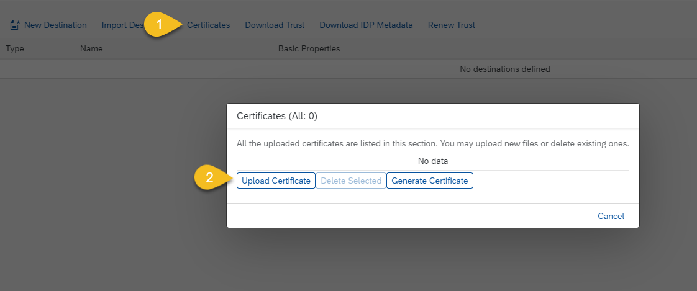
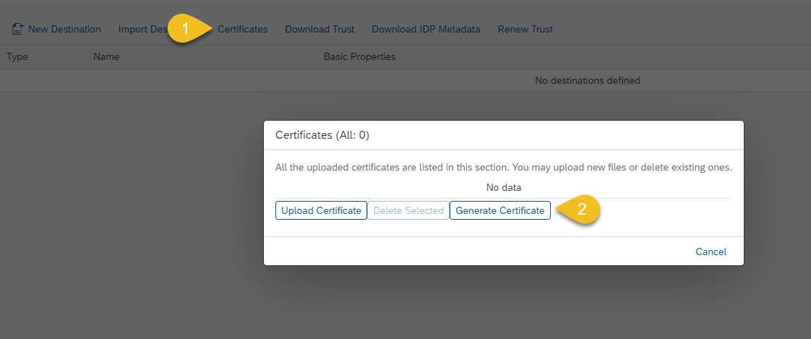
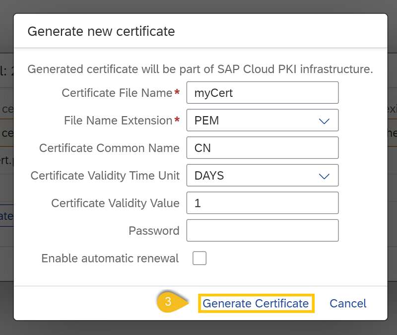

<!-- loiodf1bb55a526942b9bee78fea2ebb3162 -->

# Use Destination Certificates

Maintain trust store and key store certificates in the *Destinations* editor \(SAP BTP cockpit\).

## Prerequisites

You have logged on to the cockpit and opened the *Destinations* editor. For more information, see [Access the Destinations Editor](access-the-destinations-editor-82ca377.md).

## Context

> ### Caution:  
> Uploaded certificates are accessible via the REST APIs, including any private data they may contain.

You can upload, add and delete certificates for your connectivity destinations.

-   You can use JKS, PFX, PEM and P12 files.
-   You can add certificates only for **HTTPS** destinations. The trust store can be used for all authentication types. A key store is available only for `ClientCertificateAuthentication` and OAuth authentication types \(as a token service keystore, see [OAuth with X.509 Client Certificates](oauth-with-x-509-client-certificates-2c162aa.md)\).
-   An uploaded certificate file should contain the entire certificate chain.

<a name="concept_qmm_jqt_f4"/>

<!-- concept\_qmm\_jqt\_f4 -->

## Procedure

## Upload Certificates

1.  Choose *Certificates*.
2.  Choose *Upload Certificate*.

    

3.  Browse to the certificate file you need to upload.

    The certificate file is added.

> ### Note:  
> You can upload a certificate during creation or editing of a destination, by clicking the *Upload and Delete Certificates* link.

> ### Caution:  
> Certificates added through the *Upload Certificate* option cannot be renewed automatically.

## Generate a SAP Cloud PKI Infrastructure Certificate

1.  Choose *Certificates*.
2.  Choose *Generate Certificate*.

    

3.  In the pop-up window, enter certificate name and type. Optionally, you can enter certificate CN and certificate validity. \(Optional\) Additionally, you can select the *Enable automatic renewal* checkbox to renew the certificate automatically when it nears its expiration date. Choose *Generate Certificate* again. The certificate is generated, and you can use it in your destinations.

    

<a name="concept_qmm_jqt_f4__section_nkl_gtq_bgb"/>

## More Information

[Create HTTP Destinations](create-http-destinations-783fa1c.md)

[Edit and Delete Destinations](edit-and-delete-destinations-372dee2.md)

[Import Destinations](import-destinations-91ee9db.md)

[Set up Trust Between Systems](set-up-trust-between-systems-82dbeca.md)

