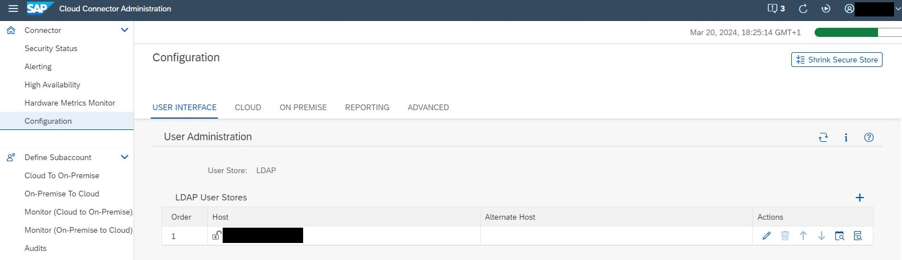

<!-- loio120ceecfd84145a181ac160d588a7a3d -->

# Use LDAP for User Administration

You can use LDAP \(Lightweight Directory Access Protocol\) to manage Cloud Connector users and authentication.

After installation, the Cloud Connector uses file-based user management by default. Alternatively, the Cloud Connector also supports LDAP-based user management. If you operate one or more LDAP servers in your landscape, you can configure the Cloud Connector to use the LDAP user base.

If LDAP authentication is active, you can assign users or user groups to the following default roles:


<table>
<tr>
<th valign="top">

User Role

</th>
<th valign="top">

Authorization

</th>
</tr>
<tr>
<td valign="top">

`sccadmin` 

</td>
<td valign="top">

Administrate the Cloud Connector \(all operations and settings\).

</td>
</tr>
<tr>
<td valign="top">

`sccsubadmin`

</td>
<td valign="top">

-   Manage all subaccount-related settings.
-   Perform support-related tasks like setting trace levels or creating a thread dump.
-   Access to some cross-subaccount settings, like system certificate settings.


</td>
</tr>
<tr>
<td valign="top">

`sccdisplay`

</td>
<td valign="top">

Access the Cloud Connector administration UI in read-only mode.

</td>
</tr>
<tr>
<td valign="top">

`sccsupport`

</td>
<td valign="top">

-   Access the Cloud Connector administration UI in read-only mode.

-   Perform support-related tasks like setting trace levels or creating a thread dump.


</td>
</tr>
<tr>
<td valign="top">

`sccmonitoring`

</td>
<td valign="top">

Provides access to the monitoring APIs, and is particularly used by the SAP Solution Manager infrastructure. For more information, see [Monitoring APIs](monitoring-apis-f6e7a7b.md).

</td>
</tr>
</table>

Authorization is checked by the Cloud Connector based on the user role retrieved by the LDAP server.


<a name="loio120ceecfd84145a181ac160d588a7a3d__section_6026F1BDC11D4C7DBEE3D00FF0359849"/>

## Setting LDAP Authentication

1.  From the main menu, choose *Configuration* and go to the *User Interface* tab.
2.  From the *User Administration* section, choose *Switch to LDAP*.

    

3.  Add further LDAP user stores by pressing the *Add* button \(plus icon\) of the **LDAP User Stores** table at the top of the dialog.

    > ### Note:  
    > The number of LDAP user stores is limited to 3. The order of the stores is significant. During logon, the given user will be authenticated by the first LDAP server in that list that succeeds in doing so.

    > ### Caution:  
    > We strongly discourage you from configuring several LDAP servers to authenticate the same user, in particular with different roles, as this may cause undesirable effects, including security issues, if LDAP servers are temporarily unavailable.

4.  Click on a row of the **LDAP User Stores** table to edit the respective LDAP configuration.
5.  Column **Actions** lets you delete or move the respective LDAP configuration.
6.  \(Optional\) To save an intermediate LDAP configuration, choose *Save Draft*. This lets you store the changes in the Cloud Connector without activation.
7.  Usually, an LDAP server lists users in an LDAP node and user groups in another node. In this case, you can use the following template for LDAP configuration. Copy the template into the configuration text area:

    ```
    roleBase="ou=groups,dc=scc" 
    roleName="cn" 
    roleSearch="(uniqueMember={0})" 
    userBase="ou=users,dc=scc" 
    userSearch="(uid={0})"
    ```

8.  Change the *<ou\>* and *<dc\>* fields in `userBase` and `roleBase`, according to the configuration on your LDAP server, or use some other LDAP query.
9.  Provide the LDAP server's host and port \(port `389` is used by default\) in the *<Host\>* field. To use the secure protocol variant LDAPS based on TLS, select *Secure*.
10. \(Optional\) Provide a failover LDAP server's host and port \(port `389` is used by default\) in the *<Alternate Host\>* field. To use the secure protocol variant LDAPS based on TLS, select *<Secure Alternate Host\>*.
11. \(Optional\) Provide a service user and its password in the fields *Connection User Name* and *Connection Password*.
12. \(Optional\) You can override the roles in the *Custom Roles* section. If no custom role is provided, the Cloud Connector checks permissions for the corresponding default role name:
    -   *<Administrator Role\>* \(default: `sccadmin`\)
    -   *<Sub-Administrator Role\>* \(default: `sccsubadmin`\)
    -   *<Support Role\>* \(default: `sccsupport`\)
    -   *<Display Role\>* \(default: `sccdisplay`\)
    -   *<Monitoring Role\>* \(default: `sccmonitoring`\)

13. You can execute an authentication test by choosing the *Test LDAP Configuration* button. In the pop-up dialog, you must specify user name and password of a user who is allowed to logon after activating the configuration. The check verifies if authentication would be successful or not for the respective LDAP configuration.

    > ### Note:  
    > We strongly recommend that you perform an authentication test. If authentication fails, login may not be possible anymore. The test dialog provides a test protocol that can be viewed and downloaded, which can be helpful for troubleshooting.
    > 
    > Be advised that such a test queries the selected LDAP server only, not the entire list of servers \(if there is more than one\). Make sure that at least one of the LDAP user stores succeeds in authenticating a given user that you want to use for logon.

    For more information about how to set up LDAP authentication, see [https://tomcat.apache.org/tomcat-9.0-doc/realm-howto.html](https://tomcat.apache.org/tomcat-8.5-doc/realm-howto.html).

    You can also configure LDAP authentication on the shadow instance in a high availability setup \(master and shadow\). From the main menu of the shadow instance, select *Shadow Configuration*, go to tab *User Interface*, and check the *User Administration* section.

    > ### Note:  
    > If you are using LDAP together with a high availability setup, you cannot use the configuration option `userPattern`. Instead, use a combination of `userSearch`, `userSubtree` and `userBase`.

    > ### Caution:  
    > An LDAP connection over TLS can cause TLS errors if the LDAP server uses a certificate that is not signed by a trusted CA. If you cannot use a certificate signed by a trusted CA, you must set up the trust relationship manually, that is, import the public part of the issuer certificate to the JDK's trust storage.
    > 
    > Usually, the *cacerts* file inside the java directory \(`jre/lib/security/cacerts`\) is used for trust storage. To import the certificate, you can use *keytool*:
    > 
    > ```
    > keytool -import -storepass changeit -file <certificate used by LDAP server> -keystore cacerts -alias <e.g. LDAP_xyz>
    > ```
    > 
    > For more information, see also [https://docs.oracle.com/cd/E19830-01/819-4712/ablqw/index.html](https://docs.oracle.com/cd/E19830-01/819-4712/ablqw/index.html).

14. After finishing the configuration, choose *Activate*. Immediately after activating the LDAP configuration, a restart of the Cloud Connector server is enforced. After restart, log on to the Cloud Connector with the credentials as per your LDAP configuration.
15. LDAP user stores may be modified, deleted, added, or moved \(that is, changed in their order\) while LDAP-based user management is active. Navigate to the **LDAP User Stores** table and perform the required actions:

    

16. To switch back to file-based user management, choose the *Switch* icon in section *User Administration* again.

> ### Note:  
> If you have set up an LDAP configuration incorrectly, you may not be able to logon to the Cloud Connector again. In this case, revert to the file-based user store without the administration UI. For more information, see the next section.


<a name="loio120ceecfd84145a181ac160d588a7a3d__section_N10119_N10013_N10001"/>

## Switching Back to File-Based User Store without the Administration UI

If your LDAP settings do not work as expected, you can use the *useFileUserStore* tool to revert to the file-based user store:

1.  Change to the installation directory of the Cloud Connector and enter the following command:

    -   **Microsoft Windows**: `useFileUserStore` 

    -   **Linux, Mac OS**: `./useFileUserStore.sh` 

    The tool will inform you about the successful modification of the user store.

2.  Restart the Cloud Connector service to activate the file-based user store:
    -   **Microsoft Windows OS**: Open the Windows *Services* console and restart the `cloud connector` service.

    -   **Linux OS**: Execute

        -   System V init distributions: `service scc_daemon restart`

        -   Systemd distributions: `systemctl restart scc_daemon`


    -   **Mac OS X**: Not applicable because no daemon exists \(for Mac OS X, only a portable variant is available\).


**Related Information**  


[LDAP Configuration: Best Practices](ldap-configuration-best-practices-703a99d.md "Get background information on LDAP configuration for the Cloud Connector.")

