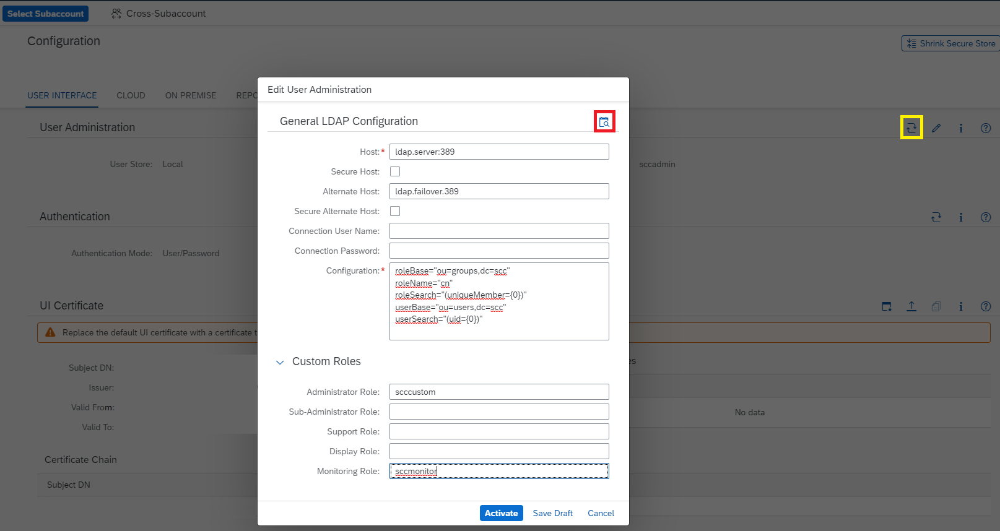

<!-- loio120ceecfd84145a181ac160d588a7a3d -->

# Use LDAP for User Administration

You can use LDAP \(Lightweight Directory Access Protocol\) to manage Cloud Connector users and authentication.

After installation, the Cloud Connector uses file-based user management by default. Alternatively, the Cloud Connector also supports LDAP-based user management. If you operate an LDAP server in your landscape, you can configure the Cloud Connector to use the LDAP user base.

If LDAP authentication is active, you can assign users or user groups to the following default roles:


<table>
<tr>
<th valign="top">

User Role

</th>
<th valign="top">

Authorization

</th>
</tr>
<tr>
<td valign="top">

`sccadmin` or `admin`

</td>
<td valign="top">

Administrate the Cloud Connector \(all CRUD operations\).

</td>
</tr>
<tr>
<td valign="top">

`sccsubadmin`

</td>
<td valign="top">

-   Manage all subaccount-related settings.
-   Perform support-related tasks like setting trace levels or creating a thread dump.

Access to common settings for all subaccounts, like system certificate settings, is permitted.

</td>
</tr>
<tr>
<td valign="top">

`sccdisplay`

</td>
<td valign="top">

Access the Cloud Connector administration UI in read-only mode.

</td>
</tr>
<tr>
<td valign="top">

`sccsupport`

</td>
<td valign="top">

-   Access the Cloud Connector administration UI in read-only mode.

-   Perform support-related tasks like setting trace levels or creating a thread dump.


</td>
</tr>
<tr>
<td valign="top">

`sccmonitoring`

</td>
<td valign="top">

Provides access to the monitoring APIs, and is particularly used by the SAP Solution Manager infrastructure, see [Monitoring APIs](monitoring-apis-f6e7a7b.md).

</td>
</tr>
</table>

Group membership is checked by the Cloud Connector.


<a name="loio120ceecfd84145a181ac160d588a7a3d__section_6026F1BDC11D4C7DBEE3D00FF0359849"/>

## Setting LDAP Authentication

1.  From the main menu, choose *Configuration* and go to the *User Interface* tab.
2.  From the *User Administration* section, choose *Switch to LDAP*.

    

3.  \(Optional\) To save intermediate adoptions of the LDAP configuration, choose *Save Draft*. This lets you store the changes in the Cloud Connector without activation.
4.  Usually, the LDAP server lists users in an LDAP node and user groups in another node. In this case, you can use the following template for LDAP configuration. Copy the template into the configuration text area:

    ```
    roleBase="ou=groups,dc=scc" 
    roleName="cn" 
    roleSearch="(uniqueMember={0})" 
    userBase="ou=users,dc=scc" 
    userSearch="(uid={0})"
    ```

    Change the *<ou\>* and *<dc\>* fields in `userBase` and `roleBase`, according to the configuration on your LDAP server, or use some other LDAP query.

    > ### Note:  
    > The configuration depends on your specific LDAP server. For details, contact your LDAP administrator.

5.  Provide the LDAP server's host and port \(port `389` is used by default\) in the *<Host\>* field. To use the secure protocol variant LDAPS based on TLS, select *Secure*.
6.  Provide a failover LDAP server's host and port \(port `389` is used by default\) in the *<Alternate Host\>* field. To use the secure protocol variant LDAPS based on TLS, select *<Secure Alternate Host\>*.
7.  \(Optional\) Depending on your LDAP server configuration you may need to specify the *<Connection User Name\>* and its *<Connection Password\>*. LDAP Servers supporting anonymous binding ignore these parameters.
8.  \(Optional\) To use your own role names, you can customize the default role names in the *Custom Roles* section. If no custom role is provided, the Cloud Connector checks permissions for the corresponding default role name:
    -   *<Administrator Role\>* \(default: `sccadmin`\)
    -   *<Support Role\>* \(default: `sccsupport`\)
    -   *<Display Role\>* \(default: `sccdisplay`\)
    -   *<Monitoring Role\>* \(default: `sccmonitoring`\)

9.  \(Optional\) Before activating the LDAP authentication, you can execute an authentication test by choosing the *Test LDAP Configuration* button. In the pop-up dialog, you must specify user name and password of a user who is allowed to logon after activating the configuration. The check verifies if authentication would be successful or not.

    > ### Note:  
    > We strongly recommend that you perform an authentication test. If authentication should fail, login is not possible anymore. The test dialog also provides a test protocol, which could be helpful for troubleshooting.

    For more information about how to set up LDAP authentication, see [tomcat.apache.org/tomcat-8.5-doc/realm-howto.html](https://tomcat.apache.org/tomcat-8.5-doc/realm-howto.html).

    > ### Note:  
    > To find a list of all supported attributes, see [https://tomcat.apache.org/tomcat-8.5-doc/config/realm.html\#JNDI\_Directory\_Realm\_-\_org.apache.catalina.realm.JNDIRealm](https://tomcat.apache.org/tomcat-8.5-doc/config/realm.html#JNDI_Directory_Realm_-_org.apache.catalina.realm.JNDIRealm).

    You can also configure LDAP authentication on the shadow instance in a high availability setup \(master and shadow\). From the main menu of the shadow instance, select *Shadow Configuration*, go to tab *User Interface*, and check the *User Administration* section.

    > ### Note:  
    > If you are using LDAP together with a high availability setup, you cannot use the configuration option `userPattern`. Instead, use a combination of `userSearch`, `userSubtree` and `userBase`.

    > ### Caution:  
    > An LDAP connection over SSL/TLS can cause SSL errors if the LDAP server uses a certificate that is not signed by a trusted CA. If you cannot use a certificate signed by a trusted CA, you must set up the trust relationship manually, that is, import the public part of the issuer certificate to the JDK's trust storage.
    > 
    > Usually, the *cacerts* file inside the java directory \(`jre/lib/security/cacerts`\) is used for trust storage. To import the certificate, you can use *keytool*:
    > 
    > ```
    > keytool -import -storepass changeit -file <certificate used by LDAP server> -keystore cacerts -alias <e.g. LDAP_xyz>
    > ```
    > 
    > For more information, see also [https://docs.oracle.com/cd/E19830-01/819-4712/ablqw/index.html](https://docs.oracle.com/cd/E19830-01/819-4712/ablqw/index.html).

10. After finishing the configuration, choose *Activate*. Immediately after activating the LDAP configuration you must restart the Cloud Connector server, which invalidates the current browser session. Refresh the browser and logon to the Cloud Connector again, using the credentials configured at the LDAP server.
11. To switch back to file-based user management, choose the *Switch* icon in section *User Administration* again.

> ### Note:  
> If you have set up an LDAP configuration incorrectly, you may not be able to logon to the Cloud Connector again. In this case, adjust the Cloud Connector configuration to use the file-based user store again *without the administration UI*. For more information, see the next section.


<a name="loio120ceecfd84145a181ac160d588a7a3d__section_N10119_N10013_N10001"/>

## Switching Back to File-Based User Store without the Administration UI

If your LDAP settings do not work as expected, you can use the useFileUserStore tool, provided with Cloud Connector version 2.8.0 and higher, to revert back to the file-based user store:

1.  Change to the installation directory of the Cloud Connector and enter the following command:
    -   **Microsoft Windows**: `useFileUserStore` 

    -   **Linux, Mac OS**: `./useFileUserStore.sh` 

2.  Restart the Cloud Connector to activate the file-based user store.

For versions older than 2.8.0, you must manually edit the configuration files.

Depending on your operating system, the configuration file is located at:

-   **Microsoft Windows OS**: `<install_dir>\config_master\org.eclipse.gemini.web.tomcat\default-server.xml`
-   **Linux OS**: `/opt/sap/scc/config_master/org.eclipse.gemini.web.tomcat/default-server.xml`
-   **Mac OS X**: `/opt/sap/scc/config_master/org.eclipse.gemini.web.tomcat/default-server.xml`

1.  Replace the `Realm` section with the following:

    ```
    
    <Realm className="org.apache.catalina.realm.LockOutRealm">
      <Realm className="org.apache.catalina.realm.CombinedRealm">
        <Realm X509UsernameRetrieverClassName="com.sap.scc.tomcat.utils.SccX509SubjectDnRetriever" className="org.apache.catalina.realm.UserDatabaseRealm" digest="SHA-256" resourceName="UserDatabase"/>
        <Realm X509UsernameRetrieverClassName="com.sap.scc.tomcat.utils.SccX509SubjectDnRetriever" className="org.apache.catalina.realm.UserDatabaseRealm" digest="SHA-1" resourceName="UserDatabase"/>
       </Realm>
    </Realm>
    ```

2.  Restart the Cloud Connector service:
    -   **Microsoft Windows OS**: Open the Windows *Services* console and restart the `cloud connector` service.
    -   **Linux OS**: Execute
        -   System V init distributions: `service scc_daemon restart`

        -   Systemd distributions: `systemctl restart scc_daemon`


    -   **Mac OS X**: Not applicable because no daemon exists \(for Mac OS X, only a portable variant is available\).


**Related Information**  


[LDAP Configuration: Best Practices](ldap-configuration-best-practices-703a99d.md "Get background information on LDAP configuration for the Cloud Connector.")

