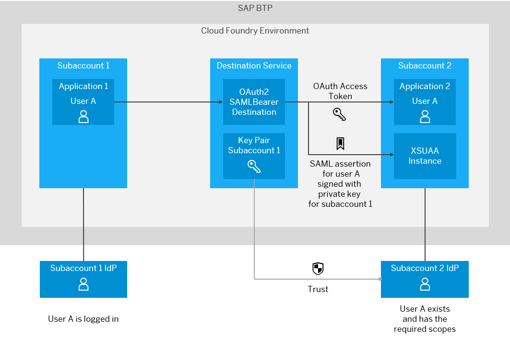
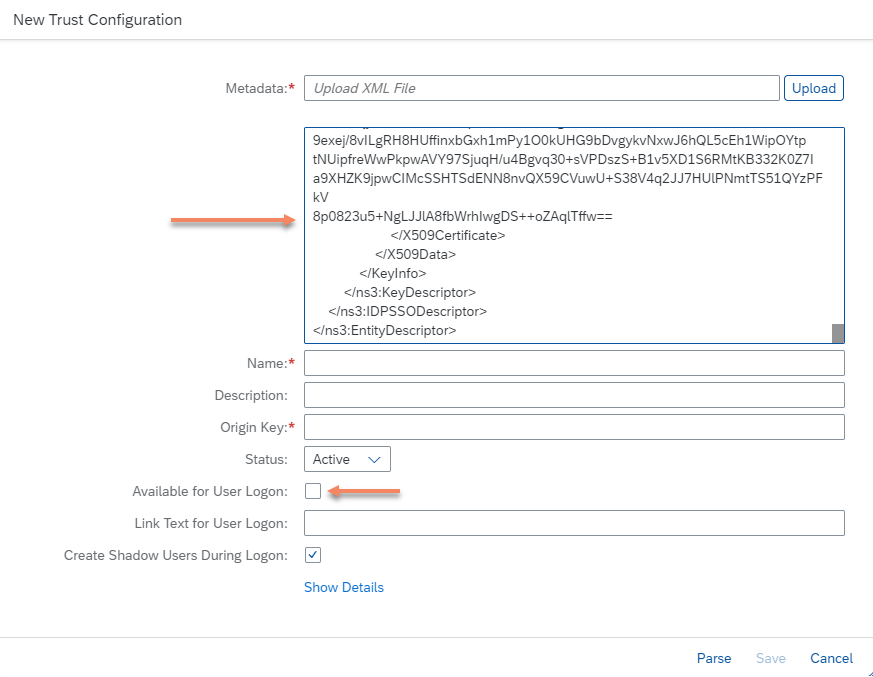
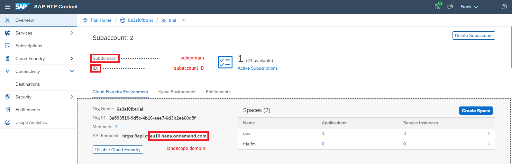
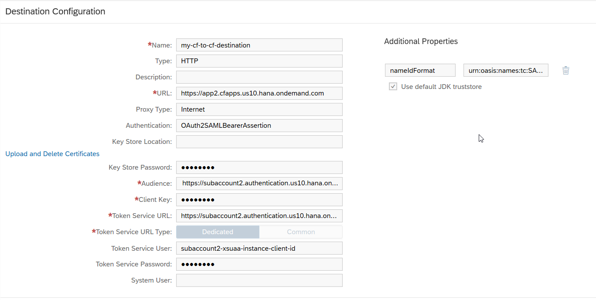

<!-- loio8ebf60c82a8e4cfc904f441c0c0acd6b -->

# User Propagation between Cloud Foundry Applications

Propagate the identity of a user between Cloud Foundry applications that are located in different subaccounts or regions.


<a name="loio8ebf60c82a8e4cfc904f441c0c0acd6b__steps"/>

## Steps

[Scenario](user-propagation-between-cloud-foundry-applications-8ebf60c.md#loio8ebf60c82a8e4cfc904f441c0c0acd6b__scenario)

[Prerequisites](user-propagation-between-cloud-foundry-applications-8ebf60c.md#loio8ebf60c82a8e4cfc904f441c0c0acd6b__prereq)

[Concept](user-propagation-between-cloud-foundry-applications-8ebf60c.md#loio8ebf60c82a8e4cfc904f441c0c0acd6b__concept)

[Procedure](user-propagation-between-cloud-foundry-applications-8ebf60c.md#loio8ebf60c82a8e4cfc904f441c0c0acd6b__procedure)

1.  [Assemble IdP Metadata for Subaccount 1](user-propagation-between-cloud-foundry-applications-8ebf60c.md#loio8ebf60c82a8e4cfc904f441c0c0acd6b__assemble)
2.  [Establish Trust between Subaccount 1 and Subaccount 2](user-propagation-between-cloud-foundry-applications-8ebf60c.md#loio8ebf60c82a8e4cfc904f441c0c0acd6b__establish)
3.  [Create an OAuthSAMLBearerAssertion Destination for Application 1](user-propagation-between-cloud-foundry-applications-8ebf60c.md#loio8ebf60c82a8e4cfc904f441c0c0acd6b__create)
4.  [Consume the Destination and Execute the Scenario](user-propagation-between-cloud-foundry-applications-8ebf60c.md#loio8ebf60c82a8e4cfc904f441c0c0acd6b__consume)


<a name="loio8ebf60c82a8e4cfc904f441c0c0acd6b__scenario"/>

## Scenario

-   You have deployed an application in a Cloud Foundry environment \(**application 1**\).
-   You want to call another Cloud Foundry application \(**application 2**\) in a different subaccount, in the same or another region.
-   You want to propagate the identity of the user that is logged in to application 1, to application 2.

Back to [Steps](user-propagation-between-cloud-foundry-applications-8ebf60c.md#loio8ebf60c82a8e4cfc904f441c0c0acd6b__steps)


<a name="loio8ebf60c82a8e4cfc904f441c0c0acd6b__prereq"/>

## Prerequisites

-   You have two applications \(application 1 and application 2\) deployed in Cloud Foundry spaces in different subaccounts in the same region or even in different regions.
-   You have an instance of the Destination service bound to application 1.
-   You have a user JWT \(JSON Web Token\) in application 1 where the call to application 2 is performed.

Back to [Steps](user-propagation-between-cloud-foundry-applications-8ebf60c.md#loio8ebf60c82a8e4cfc904f441c0c0acd6b__steps)


<a name="loio8ebf60c82a8e4cfc904f441c0c0acd6b__concept"/>

## Concept

The identity of a user logged in to application 1 is established by an identity provider \(IdP\) of the respective subaccount \(**subaccount 1**\).

> ### Note:  
> You can use the default IdP for the Cloud Foundry subaccount or a custom-configured IdP.

When the application retrieves an OAuthSAMLBearer destination, the user is made available to the Cloud Foundry Destination service by means of a *user exchange* JWT. See also [User Propagation via SAML 2.0 Bearer Assertion Flow](user-propagation-via-saml-2-0-bearer-assertion-flow-3cb7b81.md).

The service then wraps the user identity in a SAML assertion, signs it with subaccount 1's private key \(which is part of the special key pair for the subaccount, maintained by the Destination service\) and sends it to the authentication endpoint of **subaccount 2**, which hosts application 2.

To make the authentication endpoint accept the SAML assertion and return an access token, you must set up a trust relationship between the two subaccounts, by using subaccount 1's public key. You can achieve this by assembling the SAML IdP metadata, using subaccount 1's public key and setting up a new trust configuration for subaccount 2, which is based on that metadata.

This way, users propagated from application 1 can be verified by subaccount 2's IdP before granting them access tokens with their respective scopes in the context of subaccount 2.

The authentication endpoint accepts the SAML assertion and returns an OAuth access token. In turn, the Destination service returns both the destination configuration and the access token to the requesting application \(application 1\). Application 1 then uses the destination properties and the access token to call application 2.

**Option 1 - Setting up Trust between Subaccounts in the Same Region**



**Option 2 - Setting up Trust between Subaccounts in Different Regions**


Back to [Steps](user-propagation-between-cloud-foundry-applications-8ebf60c.md#loio8ebf60c82a8e4cfc904f441c0c0acd6b__steps)


<a name="loio8ebf60c82a8e4cfc904f441c0c0acd6b__procedure"/>

## Procedure


### Assemble IdP Metadata for Subaccount 1 

1.  Download the X.509 certificate of subaccount 1. For instructions, see [Set up Trust Between Systems](set-up-trust-between-systems-82dbeca.md). The content of the file is shown as:

    ```
    -----BEGIN CERTIFICATE-----<content>-----END CERTIFICATE-----
    ```

    Below, we refer to the value of <content\> as `${S1_CERTIFICATE}`.

2.  In the cockpit, navigate to the overview page of subaccount 1. For details, see [Navigate in the Cockpit](https://help.sap.com/viewer/65de2977205c403bbc107264b8eccf4b/Cloud/en-US/0874895f1f78459f9517da55a11ffebd.html "Learn how to navigate to your global accounts and subaccounts in the SAP BTP cockpit.") :arrow_upper_right:. Here you can see the landscape domain, subaccount ID and subdomain. Below, we refer to the landscape domain as `${S1_LANDSCAPE_DOMAIN}`, to the subaccount ID as `${S1_SUBACCOUNT_ID}` and to the subdomain as `${S1_SUBDOMAIN}`.

    

3.  In your browser, call `https://${S1_SUBDOMAIN}.authentication.${S1_LANDSCAPE_DOMAIN}/saml/metadata` and download the XML file. Within the XML file you can find the following structure:

    > ### Sample Code:  
    > ```
    > <?xml version="1.0" encoding="UTF-8"?>
    > ...
    > <md:AssertionConsumerService Binding="urn:oasis:names:tc:SAML:2.0:bindings:URI" Location="https://${S1_SUBDOMAIN}.authentication.${S1_LANDSCAPE_DOMAIN}/oauth/token/alias/<alias>" index="1"/>
    > ...
    > ```

    Below, we refer to the value of <alias\> as `${S1_ALIAS}`.

4.  Assemble the new IdP metadata for subaccount 1 by replacing the `${...}` placeholders in the following template with the values determined in the previous steps:

    > ### Sample Code:  
    > ```
    > <ns3:EntityDescriptor
    >     ID="cfapps.${S1_LANDSCAPE_DOMAIN}/${S1_SUBACCOUNT_ID}"
    >     entityID="cfapps.${S1_LANDSCAPE_DOMAIN}/${S1_SUBACCOUNT_ID}"
    >     xmlns="http://www.w3.org/2000/09/xmldsig#"
    >     xmlns:ns2="http://www.w3.org/2001/04/xmlenc#"
    >     xmlns:ns4="urn:oasis:names:tc:SAML:2.0:assertion"
    >     xmlns:ns3="urn:oasis:names:tc:SAML:2.0:metadata">
    >     <ns3:SPSSODescriptor AuthnRequestsSigned="true"
    >         protocolSupportEnumeration="urn:oasis:names:tc:SAML:2.0:protocol">
    >         <ns3:KeyDescriptor use="signing">
    >             <KeyInfo>
    >                 <KeyName>${S1_ALIAS}</KeyName>
    >                 <X509Data>
    >                     <X509Certificate>
    >                         ${S1_CERTIFICATE}
    >                     </X509Certificate>
    >                 </X509Data>
    >             </KeyInfo>
    >         </ns3:KeyDescriptor>
    >     </ns3:SPSSODescriptor>
    >     <ns3:IDPSSODescriptor
    >         WantAuthnRequestsSigned="true"
    >         protocolSupportEnumeration="urn:oasis:names:tc:SAML:2.0:protocol">
    >         <ns3:KeyDescriptor use="signing">
    >             <KeyInfo>
    >                 <KeyName>${S1_ALIAS}</KeyName>
    >                 <X509Data>
    >                     <X509Certificate>
    >                         ${S1_CERTIFICATE}
    >                     </X509Certificate>
    >                 </X509Data>
    >             </KeyInfo>
    >         </ns3:KeyDescriptor>
    >     </ns3:IDPSSODescriptor>
    > </ns3:EntityDescriptor>
    > ```

    Back to [Steps](user-propagation-between-cloud-foundry-applications-8ebf60c.md#loio8ebf60c82a8e4cfc904f441c0c0acd6b__steps)


### Establish Trust between Subaccount 1 and Subaccount 2

1.  In the cockpit, navigate to the overview page for subaccount 2.
2.  From the left panel, select *Security* \> *Trust Configuration*. Choose *New Trust Configuration*. For details, see [Establish Trust and Federation with UAA Using Any SAML Identity Provider](https://help.sap.com/viewer/65de2977205c403bbc107264b8eccf4b/Cloud/en-US/2ce3938c66d94479848bff3090999027.html#loio2ce3938c66d94479848bff3090999027 "To establish trust, configure the trust configuration of the SAML 2.0 identity provider in your subaccount using the SAP BTP cockpit. Next, register your subaccount in User Account and Authentication service using the administration console of your SAML 2.0 identity provider. To complete federation, maintain the federation attributes of the SAML 2.0 user groups. This makes sure that you can assign authorizations to user groups.") :arrow_upper_right:.
3.  Paste the assembled IdP metadata for subaccount 1 in the *<Metadata\>* text box and uncheck *Available for User Logon*.

    

4.  Choose *Parse*.
5.  Enter a *<Name\>* for the trust configuration and choose *Save*.

> ### Note:  
> Additionally, you must add users to this new trust configuration and assign appropriate scopes to them.

Back to [Steps](user-propagation-between-cloud-foundry-applications-8ebf60c.md#loio8ebf60c82a8e4cfc904f441c0c0acd6b__steps)


### Create an OAuthSAMLBearerAssertion Destination for Application 1

1.  In the cockpit, navigate to the overview page for subaccount 2.
2.  Here you can see the landscape domain, subaccount ID and subdomain of subaccount 2. Below, we refer to the landscape domain as `${S2_LANDSCAPE_DOMAIN}`, to the subaccount ID as `${S2_SUBACCOUNT_ID}` and to the subdomain as `${S2_SUBDOMAIN}`.

    

3.  In your browser, call `https://${S2_SUBDOMAIN}.authentication.${S2_LANDSCAPE_DOMAIN}/saml/metadata` and download the XML file. Within the XML file, you can find the following structure. It contains the <audience\> and the <alias\> variables:

    > ### Sample Code:  
    > ```
    > <?xml version="1.0" encoding="UTF-8"?>
    > <md:EntityDescriptor entityID="<audience>" ...>
    > ...
    >     <md:AssertionConsumerService Binding="urn:oasis:names:tc:SAML:2.0:bindings:URI" Location="https://${S2_SUBDOMAIN}.authentication.${S2_LANDSCAPE_DOMAIN}/oauth/token/alias/<alias>" index="1"/>
    > ...
    > ```

    Below, we refer to the value of <alias\> as `${S2_ALIAS}` and <audience\> as `${S2_AUDIENCE}`.

4.  In cockpit, navigate to subaccount 1.
5.  From the left panel, select *Connectivity* \> *Destinations*.
6.  Choose *New Destination* and configure the values as described below. Replace the `${…}` placeholders with the values you determined in the previous steps and sections.


    <table>
    <tr>
    <th valign="top">

    Property
    
    </th>
    <th valign="top">

    Value
    
    </th>
    </tr>
    <tr>
    <td valign="top">
    
    `Name`
    
    </td>
    <td valign="top">
    
    Choose any name for your destination. You will use this name to request the destination from the Destination service.
    
    </td>
    </tr>
    <tr>
    <td valign="top">
    
    `Type`
    
    </td>
    <td valign="top">
    
    `HTTP`
    
    </td>
    </tr>
    <tr>
    <td valign="top">
    
    `URL`
    
    </td>
    <td valign="top">
    
    The URL of application 2, identifying the resource you want to consume.
    
    </td>
    </tr>
    <tr>
    <td valign="top">
    
    `Proxy Type`
    
    </td>
    <td valign="top">
    
    `Internet`
    
    </td>
    </tr>
    <tr>
    <td valign="top">
    
    `Authentication`
    
    </td>
    <td valign="top">
    
    `OAuth2SAMLBearerAssertion`
    
    </td>
    </tr>
    <tr>
    <td valign="top">
    
    `Audience`
    
    </td>
    <td valign="top">
    
    `${S2_AUDIENCE}`
    
    </td>
    </tr>
    <tr>
    <td valign="top">
    
    `Client Key`
    
    </td>
    <td valign="top">
    
    The *clientid* of the XSUAA instance in subaccount 2. Can be acquired via a binding or service key.
    
    </td>
    </tr>
    <tr>
    <td valign="top">
    
    `Token Service URL`
    
    </td>
    <td valign="top">
    
    `https://${S2_SUBDOMAIN}.authentication.${S2_LANDSCAPE_DOMAIN}/oauth/token/alias/${S2_ALIAS}`
    
    </td>
    </tr>
    <tr>
    <td valign="top">
    
    `Token Service URL Type`
    
    </td>
    <td valign="top">
    
    `Dedicated`
    
    </td>
    </tr>
    <tr>
    <td valign="top">
    
    `Token Service User`
    
    </td>
    <td valign="top">
    
    The *clientid* of the XSUAA instance in subaccount 2. Can be acquired via a binding or service key.
    
    </td>
    </tr>
    <tr>
    <td valign="top">
    
    `Token Service Password`
    
    </td>
    <td valign="top">
    
    The *clientsecret* of the XSUAA instance in subaccount 2. Can be acquired via a binding or service key.
    
    </td>
    </tr>
    <tr>
    <td valign="top">
    
    `authnContextClassRef`
    
    </td>
    <td valign="top">
    
    `urn:oasis:names:tc:SAML:2.0:ac:classes:PreviousSession` 
    
    </td>
    </tr>
    </table>
    
    **Additional Properties**


    <table>
    <tr>
    <th valign="top">

    Property
    
    </th>
    <th valign="top">

    Value
    
    </th>
    </tr>
    <tr>
    <td valign="top">
    
    `nameIdFormat` 
    
    </td>
    <td valign="top">
    
    `urn:oasis:names:tc:SAML:1.1:nameid-format:emailAddress`
    
    </td>
    </tr>
    </table>
    
    **Example**

    

7.  Choose *Save*.

Back to [Steps](user-propagation-between-cloud-foundry-applications-8ebf60c.md#loio8ebf60c82a8e4cfc904f441c0c0acd6b__steps)


### Consume the Destination and Execute the Scenario 

To perform the scenario and execute the request from application 1, targeting application 2, proceed as follows:

1.  Decide on where the user identity will be located when calling the Destination service. For details, see [User Propagation via SAML 2.0 Bearer Assertion Flow](user-propagation-via-saml-2-0-bearer-assertion-flow-3cb7b81.md). This will determine how exactly you will perform step 2.
2.  Execute a "find destination" request from application 1 to the Destination service. For details, see [Consuming the Destination Service](consuming-the-destination-service-7e30625.md) and the [REST API documentation](https://api.sap.com/api/SAP_CP_CF_Connectivity_Destination/resource).
3.  From the Destination service response, extract the access token and URL, and construct your request to application 2. See ["Find Destination" Response Structure](find-destination-response-structure-83a3f3b.md) for details on the structure of the response from the Destination service.

Back to [Steps](user-propagation-between-cloud-foundry-applications-8ebf60c.md#loio8ebf60c82a8e4cfc904f441c0c0acd6b__steps)


