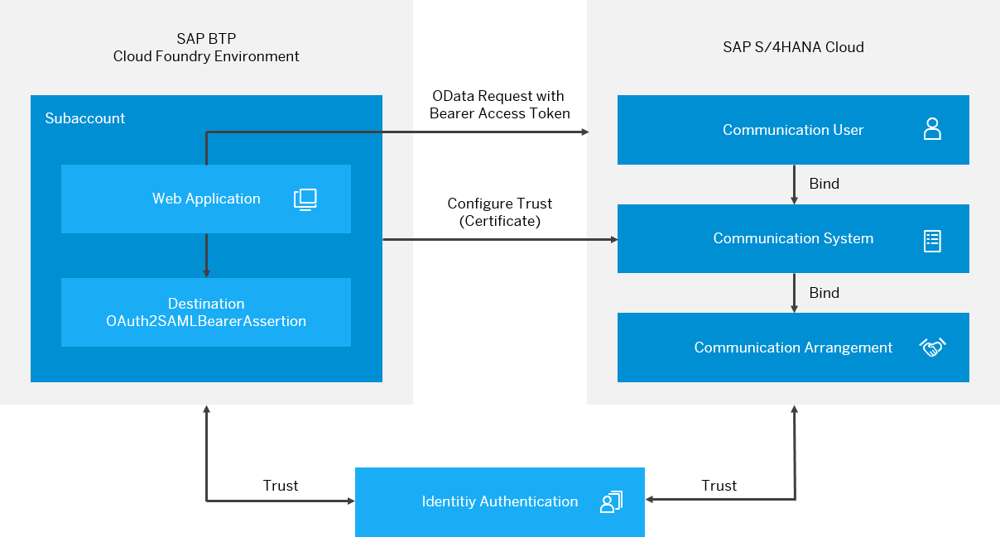

<!-- loio9af03a067bf74457ba0de0221b9cc72a -->

# User Propagation from the Cloud Foundry Environment to SAP S/4HANA Cloud

Configure user propagation \(single sign-on\), using OAuth communication from the SAP BTP Cloud Foundry environment to S/4HANA Cloud. As OAuth mechanism, you use the *OAuth 2.0 SAML Bearer Assertion Flow*.

<a name="loio9af03a067bf74457ba0de0221b9cc72a__section_rrf_rm5_2gb"/>

## Steps

[Scenario](user-propagation-from-the-cloud-foundry-environment-to-sap-s-4hana-cloud-9af03a0.md#loio9af03a067bf74457ba0de0221b9cc72a__scenario_s4) 

[Prerequisites](user-propagation-from-the-cloud-foundry-environment-to-sap-s-4hana-cloud-9af03a0.md#loio9af03a067bf74457ba0de0221b9cc72a__prereq_s4)

[Configuration Tasks](configuration-tasks-6e5e004.md)

<a name="loio9af03a067bf74457ba0de0221b9cc72a__scenario_s4"/>

## Scenario

As a customer, you own an SAP BTP global account and have created at least one subaccount therein. Within the subaccount, you have deployed a Web application. Authentication against the Web application is based on a trusted identity provider \(IdP\) that you need to configure for the subaccount.

On the S/4HANA Cloud side, you own an S/4HANA ABAP tenant. Authentication against the S/4HANA ABAP tenant is based on the trusted IdP which is always your Identity Authentication Service \(IAS\) tenant. Typically, you will configure this S/4HANA Cloud Identity tenant to forward authentication requests to your corporate IdP.

<a name="loio9af03a067bf74457ba0de0221b9cc72a__prereq_s4"/>

## Prerequisites

-   You have an S/4HANA Cloud tenant and a user with the following business catalogs assigned:

    <table>
    <tr>
    <th valign="top">

    Business Role ID
    
    </th>
    <th valign="top">

    Area
    
    </th>
    </tr>
    <tr>
    <td valign="top">
    
    SAP\_BCR\_CORE\_COM
    
    </td>
    <td valign="top">
    
    Communication Management
    
    </td>
    </tr>
    <tr>
    <td valign="top">
    
    SAP\_BCR\_CORE\_IAM
    
    </td>
    <td valign="top">
    
    Identity and Access Management
    
    </td>
    </tr>
    <tr>
    <td valign="top">
    
    SAP\_BCR\_CORE\_EXT
    
    </td>
    <td valign="top">
    
    Extensibility
    
    </td>
    </tr>
    </table>
    
-   You have administrator permission for the configured S/4HANA Cloud IAS tenant.

-   You have a subaccount and PaaS tenant in the SAP BTP Cloud Foundry environment.

<a name="loio9af03a067bf74457ba0de0221b9cc72a__section_oxm_zz4_cgb"/>

## Next Step

-   [Configuration Tasks](configuration-tasks-6e5e004.md)

