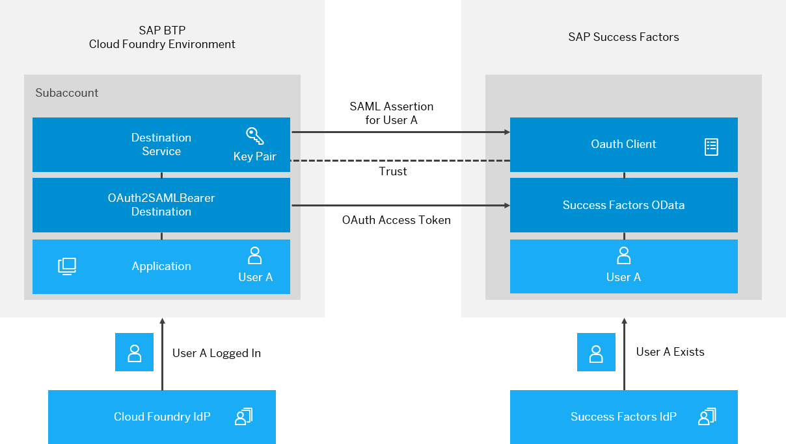

<!-- loio67a3b83989fd4c4f8aef2f9e2ce3787a -->

# User Propagation from the Cloud Foundry Environment to SAP SuccessFactors

Configure user propagation from the SAP BTP Cloud Foundry environment to SAP SuccessFactors.

<a name="loio67a3b83989fd4c4f8aef2f9e2ce3787a__section_e4d_hm5_2gb"/>

## Steps

[Scenario](user-propagation-from-the-cloud-foundry-environment-to-sap-successfactors-67a3b83.md#loio67a3b83989fd4c4f8aef2f9e2ce3787a__scenario_sf) 

[Prerequisites](user-propagation-from-the-cloud-foundry-environment-to-sap-successfactors-67a3b83.md#loio67a3b83989fd4c4f8aef2f9e2ce3787a__prereq_sf)

[Concept Overview](user-propagation-from-the-cloud-foundry-environment-to-sap-successfactors-67a3b83.md#loio67a3b83989fd4c4f8aef2f9e2ce3787a__concept_sf)

[Create an OAuth Client in SAP SuccessFactors](create-an-oauth-client-in-sap-successfactors-69130a7.md)

[Create and Consume a Destination for the Cloud Foundry Application](create-and-consume-a-destination-for-the-cloud-foundry-application-0781bb6.md)

<a name="loio67a3b83989fd4c4f8aef2f9e2ce3787a__scenario_sf"/>

## Scenario

-   From an application in the SAP BTP Cloud Foundry environment, you want to consume OData APIs exposed by SuccessFactors modules.
-   To enable single sign-on, you want to propagate the identity of the application's logged-in user to SuccessFactors.

<a name="loio67a3b83989fd4c4f8aef2f9e2ce3787a__prereq_sf"/>

## Prerequisites

-   In your Cloud Foundry space, you have a deployed application.
-   You have an instance of the Destination Service that is bound to the application.
-   An instance of the xsuaa service with `application` plan is bound to the application.

<a name="loio67a3b83989fd4c4f8aef2f9e2ce3787a__concept_sf"/>

## Concept Overview

A user logs in to the Cloud Foundry application. Its identity is established by an **Identity Provider** \(IdP\). This could be the default IdP for the Cloud Foundry subaccount or a trusted IdP, for example the SuccessFactors IdP.

When the application retrieves an `OAuth2SAMLBearer` destination, the user is made available to the Cloud Foundry Destination service by means of a **user exchange token**, represented by a JSON Web Token \(JWT\). The service then wraps the user identity in a SAML assertion, signs it with the Cloud Foundry subaccount private key and sends it to the token endpoint of the SuccessFactors OAuth server.

To accept the SAML assertion and return an **access token**, a **trust** relationship must be set up between SuccessFactors and the Cloud Foundry subaccount public key. You can achieve this by providing the Cloud Foundry subaccount **X.509 certificate** when creating the OAuth client in SuccessFactors.

Users that are propagated from the Cloud Foundry application, are verified by the SuccessFactors OAuth server before granting them access tokens. This means, users that do not exist in the SuccessFactors user store will be rejected.

For valid users, the OAuth server accepts the SAML assertion and returns an OAuth access token. In turn, the Destination service returns both the destination and the access token to the requesting application. The application then uses the destination properties and the access token to consume SuccessFactors APIs.

<a name="loio67a3b83989fd4c4f8aef2f9e2ce3787a__section_urc_gqw_cgb"/>

## Next Steps

-   [Create an OAuth Client in SAP SuccessFactors](create-an-oauth-client-in-sap-successfactors-69130a7.md)
-   [Create and Consume a Destination for the Cloud Foundry Application](create-and-consume-a-destination-for-the-cloud-foundry-application-0781bb6.md)

