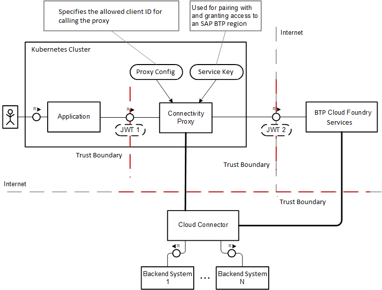

<!-- loiof3c1ef45db77489c8d039acc9530358f -->

# Using the Connectivity Proxy

Use the connectivity proxy for Kubernetes with different communication protocols and principal propagation \(SSO\).

[Overview](using-the-connectivity-proxy-f3c1ef4.md#loiof3c1ef45db77489c8d039acc9530358f__overview)

[TCP](using-the-connectivity-proxy-f3c1ef4.md#loiof3c1ef45db77489c8d039acc9530358f__tcp)

[HTTP](using-the-connectivity-proxy-f3c1ef4.md#loiof3c1ef45db77489c8d039acc9530358f__http)

[Principal Propagation](using-the-connectivity-proxy-f3c1ef4.md#loiof3c1ef45db77489c8d039acc9530358f__pp)

[Technical User Propagation](using-the-connectivity-proxy-f3c1ef4.md#loiof3c1ef45db77489c8d039acc9530358f__technical)


<a name="loiof3c1ef45db77489c8d039acc9530358f__overview"/>

## Overview

The connectivity proxy offers multiple proxy endpoints which are communication protocol-specific: TCP \(via SOCKS5\), HTTP, RFC \(invoking ABAP functions\) and LDAP. Depending on the operational mode, the usage may involve technical authorization when connecting to the proxy, see [Operational Modes](operational-modes-148bbad.md).



Basically, the application needs to connect to the target on-premise system, and select the respective host and port as a protocol-standard proxy \(with optional authorization\) to get the request routed to the target on-premise system via the Cloud Connector.

> ### Note:  
> -   The tunnel channel \(between Cloud Connector and connectivity proxy\) always uses TLS, that is, it is encrypted.
> -   The actual connection from the application to the connectivity proxy may be encrypted or not, depending on the exact scenario used.
> 
>     > ### Note:  
>     > If a TLS connection is attempted by the application, the SOCKS5 proxy endpoint must be used.
> 
> -   The actual connection from the Cloud Connector towards the on-premise system is established and controlled in the Cloud Connector. As a result, TLS can be enabled or disabled, regardless of the connection from the application to the connectivity proxy.

[Back to Top](using-the-connectivity-proxy-f3c1ef4.md#loiof3c1ef45db77489c8d039acc9530358f__top)


<a name="loiof3c1ef45db77489c8d039acc9530358f__tcp"/>

## TCP

TCP connectivity is achieved via the [SOCKS5](https://en.wikipedia.org/wiki/SOCKS) proxy protocol. As the authorization is based on OAuth, we provide a custom authorization scheme for SOCKS5 that lets the application pass the required OAuth tokens and establish technical authorization with the connectivity proxy. For more information, see [Using the TCP Protocol for Cloud Applications](using-the-tcp-protocol-for-cloud-applications-cd15837.md).

[Back to Top](using-the-connectivity-proxy-f3c1ef4.md#loiof3c1ef45db77489c8d039acc9530358f__top)


<a name="loiof3c1ef45db77489c8d039acc9530358f__http"/>

## HTTP

Uses a standard HTTP proxy, just like using a corporate proxy to reach out to the Internet. For more information, see [Authentication to the On-Premise System](authentication-to-the-on-premise-system-67b0b94.md).

```
curl --proxy "connectivity-proxy-host:20003" /
http://my-virtual-host:1234/my-path#my-fragment?my-query=my-value /
--header "Proxy-Authorization: Bearer <token>"
```

[Back to Top](using-the-connectivity-proxy-f3c1ef4.md#loiof3c1ef45db77489c8d039acc9530358f__top)


<a name="loiof3c1ef45db77489c8d039acc9530358f__pp"/>

## Principal Propagation

*Principal propagation*, also known as *user propagation*, lets you perform single sign-on \(SSO\) authentication of the cloud user towards an on-premise system.

The cloud user identity is passed as a token represented by a JSON Web token \(JWT\). It is forwarded via the connectivity proxy to the Cloud Connector, which validates and further processes it to establish SSO with the on-premise system.

For more information, see [Authenticating Users against On-Premise Systems](authenticating-users-against-on-premise-systems-b643fbe.md) and [Set Up Trust](set-up-trust-a4ee70f.md).

As of connectivity proxy release 2.1.1, support for principal propagation with IAS tokens is added.

**Prerequisites**:

-   Cloud Connector 2.13 \(or higher\) must be used.
-   The Cloud Connector must be connected to a subaccount, that is, configured with the IAS tenant issuing the tokens \(for more information, see [Establish Trust and Federation Between SAP Authorization and Trust Management Service and SAP Cloud Identity Services](https://help.sap.com/viewer/65de2977205c403bbc107264b8eccf4b/Cloud/en-US/161f8f0cfac64c4fa2d973bc5f08a894.html "Use your SAP Cloud Identity Services tenant as an identity provider or a proxy to your own identity provider hosting your business users. This method avoids the upload and download of SAML meta data by using Open ID Connect (OIDC) to establish trust.") :arrow_upper_right:\).

Principal propagation is supported for both HTTP and RFC communication protocols and can be used in all [Operational Modes](operational-modes-148bbad.md) of the connectivity proxy:

-   **Single-tenant in trusted environment**

    The user should be propagated via `SAP-Connectivity-Authentication` header.


-   **Multi-tenant in trusted environment**

    The user should be propagated only via `SAP-Connectivity-Authentication` header.

    The `SAP-CP-Connectivity-Service-Token` header *must* be sent for handling the tenant context.


-   **Single or multi-tenant in non-trusted environment**

    The user should be propagated via either `Proxy-Authorization` or `SAP-Connectivity-Authentication` header, exclusively. If `Proxy-Authorization` is used, it must hold a JWT that results from a token exchange \(see [JWT Bearer Grant Type](https://docs.cloudfoundry.org/api/uaa/version/74.0.0/#jwt-bearer-token-grant)\), to include both the context for technical access toward the Connectivity Proxy as well as the user identity.

    > ### Note:  
    > If IAS tokens are used, they can *only* be provided via the `SAP-Connectivity-Authentication` header.


> ### Note:  
> If in a **non-trusted environment** the user context is provided via the `Proxy-Authorization` header, the `SAP-Connectivity-Authentication` *must not* be sent.

> ### Caution:  
> In principal propagation scenarios, you must omit the `Authorization` header.

For more information, see also [XSUAA Token Client and Token Flow API](https://github.com/SAP/cloud-security-xsuaa-integration/tree/master/token-client).

[Back to Top](using-the-connectivity-proxy-f3c1ef4.md#loiof3c1ef45db77489c8d039acc9530358f__top)


<a name="loiof3c1ef45db77489c8d039acc9530358f__technical"/>

## Technical User Propagation

*Technical user propagation* lets you perform single sign-on \(SSO\) authentication of a cloud technical user towards an on-premise system. It is very similar to *principal propagation*, but instead of forwarding the identity of business users, the identity of technical users is forwarded.

The technical user is represented by a token in form of a JSON web token \(JWT\) that is usually obtained via the `client_credentials` OAuth flow. It is forwarded via the connectivity proxy to the Cloud Connector, which validates and processes it to perform SSO with the on-premise system.

Technical user propagation is supported as of connectivity proxy version 2.6.1. As a prerequisite, Cloud Connector version 2.15 or higher must be used.

Technical user propagation is supported for both HTTP and RFC communication protocols and can be used in all [Operational Modes](operational-modes-148bbad.md).

The token representing the technical user must be sent to the connectivity proxy via the `SAP-Connectivity-Technical-Authentication` HTTP request header.

> ### Caution:  
> In *technical user propagation* scenarios, you must omit the `Authorization` header.

For more information, see [Configuring Principal Propagation](configuring-principal-propagation-c84d4d0.md) and [XSUAA Token Client and Token Flow API](https://github.com/SAP/cloud-security-xsuaa-integration/tree/master/token-client).

[Back to Top](using-the-connectivity-proxy-f3c1ef4.md#loiof3c1ef45db77489c8d039acc9530358f__top)

